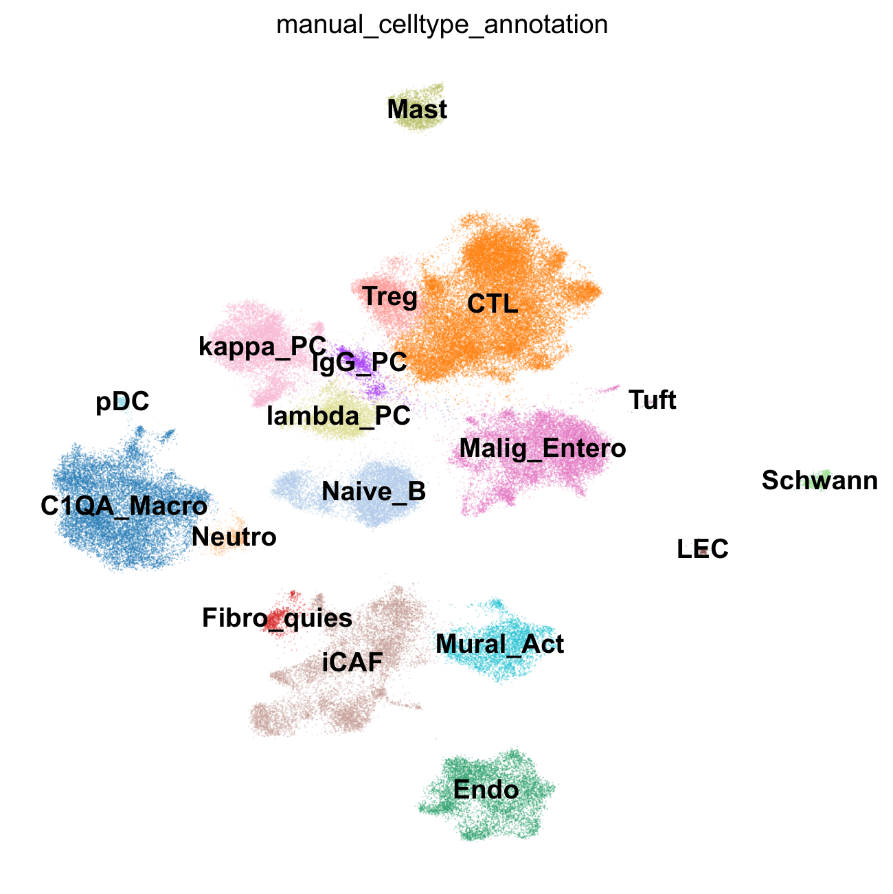

CRC-SingleCell-Atlas

A single-cell Python/R framework for mapping the CRC-Metastasis axis. Employs scVI for deep-learning batch correction, PyDESeq2 for robust pseudobulk DE, and CellChat to infer tumor-microenvironment signaling


# CRC-SingleCell-Atlas: Single-Cell RNA-seq of Colorectal Cancer and Liver Metastases


[]()
[]()
[]()
[]()

## 📖 Overview

This repository contains a complete computational pipeline for constructing a **single-cell transcriptomic atlas of colorectal cancer (CRC)**. The atlas spans primary tumors, adjacent normal tissues, and paired liver metastases, providing insights into the metastatic transition and the tumor microenvironment.

**Dataset:** [GSE315534](https://www.ncbi.nlm.nih.gov/geo/query/acc.cgi?acc=GSE315534)
- 6 Adjacent normal tissues (N1-N6)
- 6 Primary colorectal tumors (T1-T6)
- 3 Paired liver metastases (LM1-LM3)


*Figure 1: Integrated landscape of the CRC single-cell atlas across 15 patient samples.*

### Pipeline Features:

**🔬 Quality Control & Processing**
- Per-sample QC with MAD or threshold-based filtering.
- SoupX-informed ambient RNA removal (via R/rpy2 bridge).
- scDblFinder doublet detection and removal.

**🔄 Integration & Clustering**
- scVI batch integration for patient-specific effect correction.
- Leiden clustering with resolution optimization.
- Manual cell type annotation of 18 distinct populations.

**📈 Differential Expression & Pathways**
- Pseudobulk DESeq2 differential expression analysis.
- Gene Set Enrichment Analysis (GSEA) via `decoupler`.

**💬 Cell-Cell Communication**
- CellChat intercellular signaling analysis.
- Comparative communication analysis (Normal vs. Tumor).

---

## 📖 Documentation

Detailed guides for every stage of the analysis are located in the `docs/` folder:

* **[Installation & Usage](./docs/USAGE.md)**: Hardware requirements and step-by-step execution.
* **[Computational Methods](./docs/METHODS.md)**: Technical details on SoupX, scVI, and DESeq2 parameters.
* **[Biological Interpretation](./docs/INTERPRETATION.md)**: A guide to decoding the results and signaling pathways.

---

## 🗂️ Repository Structure
```

CRC_Atlas/
├── config.py                                      # Central configuration and pathway infrastructure
├── environment.yml                                # Conda environment specification (Python & R)
├── README.md                                      # Main project documentation and usage guide
├── data/
│   └── raw/                                       # Input 10x Genomics data (Matrix, Barcodes, Features)
│       ├── GSM9430352_CRC_N1/                     # Sample N1 (Normal)
│       ├── GSM9430353_CRC_T1/                     # Sample T1 (Tumor)
│       ├── GSM9430354_CRC_LM1/                    # Sample LM1 (Liver Metastasis)
│       ├── GSM9430355_CRC_N2/                     # Sample N2
│       ├── GSM9430356_CRC_T2/                     # Sample T2
│       ├── GSM9430357_CRC_LM2/                    # Sample LM2
│       ├── GSM9430358_CRC_N3/                     # Sample N3
│       ├── GSM9430359_CRC_T3/                     # Sample T3
│       ├── GSM9430360_CRC_LM3/                    # Sample LM3
│       ├── GSM9430361_CRC_N4/                     # Sample N4
│       ├── GSM9430362_CRC_T4/                     # Sample T4
│       ├── GSM9430363_CRC_N5/                     # Sample N5
│       ├── GSM9430364_CRC_T5/                     # Sample T5
│       ├── GSM9430365_CRC_N6/                     # Sample N6
│       └── GSM9430366_CRC_T6/                     # Sample T6
├── scripts/                                       # Pipeline execution scripts
│   ├── 01_preprocessing.py                        # Per-sample QC and Ambient RNA removal
│   ├── 02_integration.py                          # scVI batch correction and integration
│   ├── 03_cluster_characterization.py             # Marker gene identification
│   ├── 04_cell_type_annotation.py                 # Manual cell type labeling
│   ├── 05_pseudobulk_analysis.py                  # DESeq2 differential expression
│   ├── 06_gsea.py                                 # Gene Set Enrichment Analysis
│   ├── 07_cell_cell_communication.py              # Individual condition CellChat analysis
│   ├── 07_cell_cell_communication.R               # R worker for CellChat inference
│   ├── 08_differential_communication.py           # Comparative signaling analysis
│   └── 08_differential_communication.R            # R worker for differential signaling
├── src/                                           # Modular source code (The Engine)
│   ├── cellchats.R                                # R functions for communication analysis
│   ├── clustering.py                              # Leiden and resolution optimization logic
│   ├── deg.py                                     # Differential expression calculation logic
│   ├── gsea.py                                    # Pathway enrichment logic
│   ├── integration.py                             # scVI model training and latent setup
│   ├── preprocessing.py                           # MAD filtering and SoupX integration
│   ├── pseudobulk.py                              # Data aggregation for DESeq2
│   ├── qc_utils.py                                # Summary reporting and QC metrics
│   ├── utils.py                                   # File I/O and general utilities
│   ├── visualization.py                           # Plotting functions for all stages
│   └── __init__.py                                # Package initialization
├── docs/                                          # Detailed project documentation
│   ├── INTERPRETATION.md                          # Biological results interpretation guide
│   ├── METHODS.md                                 # Full computational methodology
│   └── USAGE.md                                   # Step-by-step execution instructions
├── results/                                       # Generated data and models
│   ├── 01_preprocessing/                          # Cleaned .h5ad files and processing logs
│   ├── 02_integration/                            # Integrated objects and saved scVI model
│   ├── 03_cluster_characterization/               # Marker gene CSV files (top 20 and full lists)
│   ├── 04_cell_type_annotation/                   # Final annotated atlas objects
│   ├── 05_pseudobulk_analysis/                    # DESeq2 results and pseudobulk objects
│   ├── 06_gsea/                                   # Pathway enrichment results (Hallmark/ImmuneSig)
│   ├── 07_cell_cell_communication_analysis/       # Individual CellChat .rds objects
│   └── 08_cell_cell_communication_differential/   # Merged CellChat comparative objects
└── figures/                                       # All visualization outputs
    ├── qc/                                        # Per-sample QC (Scatter, Violin, PCA)
    ├── clustering/                                # Resolution optimization and doublet plots
    ├── integration/                               # Training history and batch mixing UMAPs
    ├── cluster_characterization/                  # Marker gene dotplots and heatmaps
    ├── cell_type_annotation/                      # Final annotated UMAPs
    ├── pseudobulk/                                # Volcano and PCA plots per cell type
    ├── gsea/                                      # Pathway enrichment dotplots
    └── cellchat_communication/                    # Network circle plots, bubble plots, and patterns
        ├── Normal_samples_annotated/              # Baseline signaling visualizations
        ├── Tumor_samples_annotated/               # Disease signaling visualizations
        └── differential_communication/            # Comparative signaling plots
```

---

## 🚀 Quick Start

### 1. Clone and Navigate
```bash
git clone https://github.com/Loai3tr/rnaseq.git
cd rnaseq
```

### 2. Set up Environment
The `environment.yml` contains both Python and R dependencies (including Seurat and CellChat).
```bash
# Create and activate environment
conda env create -f environment.yml
conda activate scrna_pipeline
```

### 3. Data Preparation
Download [GSE315534](https://www.ncbi.nlm.nih.gov/geo/query/acc.cgi?acc=GSE315534) and place the 10x CellRanger outputs into `data/raw/` using this format:
`data/raw/{Sample_ID}/[barcodes.tsv.gz, features.tsv.gz, matrix.mtx.gz]`

### 4. Configure & Run
Update the paths in `config.py` (specifically `R_HOME` for Windows), then run the scripts in order:
```bash
python scripts/01_preprocessing.py
python scripts/02_integration.py
# ... proceed through scripts 03 to 08
```

---

## 📊 Key Results

| Output | Location |
| :--- | :--- |
| **Final Annotated Atlas** | `results/04_cell_type_annotation/*.h5ad` |
| **Marker Gene Lists** | `results/03_cluster_characterization/*.csv` |
| **Differential Expression** | `results/05_pseudobulk_analysis/*.csv` |
| **Pathway Enrichment** | `results/06_gsea/*.csv` |
| **CellChat Objects** | `results/07_cell_cell_communication_analysis/*.rds` |

---

## 📝 Citation


Loai E. (2026). *CRC_Atlas: A computational pipeline for single-cell analysis of colorectal cancer and liver metastases.*

---

## 🔗 Connect
If you have questions about the pipeline or are interested in collaboration regarding single-cell analysis:

* **LinkedIn:** [Loai Eletr](https://linkedin.com/in/yourprofile)
* **Email:** `Loai.eletr65@yahoo.com`