# Biological Interpretation Guide: CRC-SingleCell-Atlas

**Purpose:** This guide explains how to interpret each analysis output, what biological conclusions to draw, and how to identify potential artifacts.

---

## Table of Contents

1. [Quality Control Interpretation](#1-quality-control-interpretation)
2. [Integration and Clustering Interpretation](#2-integration-and-clustering-interpretation)
3. [Cell Type Annotation Interpretation](#3-cell-type-annotation-interpretation)
4. [Pseudobulk DE Interpretation](#4-pseudobulk-de-interpretation)
5. [GSEA Interpretation](#5-gsea-interpretation)
6. [Cell-Cell Communication Interpretation](#6-cell-cell-communication-interpretation)
7. [Differential Communication Interpretation](#7-differential-communication-interpretation)

---

## 1. Quality Control Interpretation

*(Using Sample N2 as an example)*

### 1.1 Initial QC Assessment

**Scatter plot (`scatter_N2_initial_qc.pdf`):**

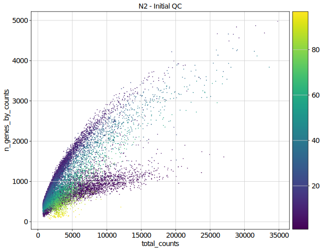

The initial scatter plot reveals two distinct populations of low-quality cells:

- **Cells with low total counts but high mt%:** These represent dying, damaged, or poor-quality cells where cytoplasmic RNA has leaked out, leaving behind mostly mitochondrial transcripts.
- **Cells with excessively high total counts:** These are likely doublets (two cells captured in one droplet), creating artificially high UMI counts.

**Violin plot (`violin_N2_initial_qc.pdf`):**


The pre-filtering distribution shows:
- **Total counts:** Wide range from 0 to ~35,000 UMI
- **n_genes_by_counts:** Highly variable, with some cells showing very low gene counts (<200)
- **pct_counts_mt:** Alarming distribution - some cells have >40% mitochondrial reads, indicating severe cell stress or membrane rupture

### 1.2 Filtering Strategy Applied

Based on this initial assessment, we applied:

- **MAD cutoff = 3** (Median Absolute Deviation) to remove statistical outliers
- **mt% threshold = 12%** (conservative cutoff to retain biologically relevant mitochondrial activity in tumor cells)

**Rationale for 12% mt threshold:** While typical QC recommends <10% or <20%, we selected 12% as a compromise - strict enough to remove damaged cells but permissive enough to retain metabolically active tumor cells that naturally have higher mitochondrial content.

### 1.3 Post-Filtering Assessment

**Scatter plot (`scatter_N2_post-filtering.pdf`):**

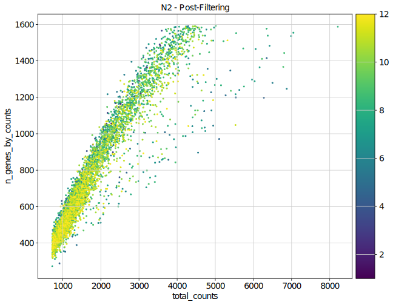

After filtering, the scatter plot shows dramatic improvement:
- Low-quality cells with high mt% and low counts are removed
- High-count doublet candidates are eliminated
- The remaining cells form a tighter, more homogeneous distribution

**Violin plot (`violin_N2_post-filtering.pdf`):**


Quality metrics improved substantially:
- **Total counts:** Now condensed to 1,000-8,000 UMI range (physiological range)
- **n_genes_by_counts:** Tightened to 400-1,600 genes per cell
- **pct_counts_mt:** Reduced significantly, though some cells still show ~12% mt (retained as potentially real biological信号)

### 1.4 Clustering for SoupX Input


We performed Leiden clustering at **resolution 0.5** on the filtered data to:
- Define cluster structure for SoupX ambient RNA estimation
- Identify potential doublet-enriched clusters

**Output:** `umap_N2_leiden_resolution_optimization_*.pdf`

### 1.5 Ambient RNA Removal (SoupX)

**Rho value:** 0.03 (3% estimated ambient contamination)

- **Interpretation:** Low-level ambient RNA contamination present
- **Action:** Correction applied (default for all samples)
- **Impact:** Subtle but improves downstream differential expression accuracy

### 1.6 Doublet Detection (scDblFinder)


**Doublet rate:** 7.7% (typical for 10x Genomics data)

**UMAP visualization (`umap_N2_doublet_qc_*.pdf`):**


The doublet distribution plot reveals:
- Doublets are distributed across multiple clusters (not concentrated in one population)
- Some clusters have slightly higher doublet enrichment (likely due to cell size or adhesion properties)
- Overall, doublet contamination is within expected range for 10x data

### 1.7 Final QC Assessment

**Violin plot (`violin_N2_final_cleaned.pdf`):**


After both SoupX correction and doublet removal:
- **Minimal visible change** from post-filtering stage - this is expected because:
  - SoupX corrects expression values, not QC metrics
  - Doublet removal affects only 7.7% of cells
- The distribution remains tight and within acceptable ranges

**Scatter plot (`scatter_N2_final_cleaned.pdf`):**

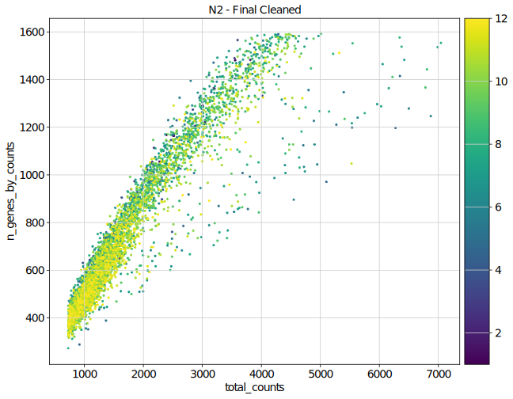

Final cell population is clean and suitable for downstream integration and analysis.

### 1.8 Summary for N2

| Stage | Cells Removed | Key Observation |
|-------|---------------|-----------------|
| Initial | - | High mt% cells (>40%) and probable doublets present |
| Post-filtering | Poor quality + doublets | Clean population; some cells retain ~12% mt |
| Post-SoupX | 0 (expression correction) | Rho = 0.03 (minimal ambient contamination) |
| Post-doublet removal | 7.7% | Doublets distributed across clusters |
| **Final** | **Refined Dataset** | **High-quality cells ready for integration** |

### 1.9 Biological Note

The presence of cells with 12-15% mitochondrial reads **after filtering** likely represents real biology:
- Tumor cells undergoing metabolic stress
- Activated immune cells with high metabolic activity
- Not technical artifacts (confirmed by retained gene count complexity)

---
## 2. Integration and Clustering Interpretation

### 2.1 Pre-Integration: Assessing Batch Effects

**Figure:** `figures/integration/umap_merged_dataset_Pre-Integration Composition.pdf`


Before batch integration, we first assessed whether batch effects were apparent in the raw merged data.

**What the pre-integration UMAP shows:**

The plot reveals **clear separation of cells by batch** (S1-S6, colored by patient ID), with:
- Cells from the same patient clustering together
- Minimal mixing between patients within the same biological condition
- Condition labels (Normal, Tumor, Metastasis) scattered across batches

**Conclusion:** Strong batch effects are present, primarily driven by patient-to-patient technical variation rather than true biological differences. Batch correction is essential.

### 2.2 Method Selection: scVI vs Harmony

We selected **scVI** over Harmony for this dataset because:

| Feature | scVI | Harmony |
|---------|------|---------|
| Handles complex cancer heterogeneity | ✅ Excellent | ✅ Good |
| Probabilistic latent space | ✅ Yes | ❌ No |
| Works with variable sequencing depth | ✅ Yes | ⚠️ Limited |
| Memory efficiency for large datasets | ✅ Good | ✅ Good |
| Generates corrected counts | ✅ Yes | ❌ No |

**Rationale:** scVI's deep generative approach is better suited for complex cancer datasets where batch effects may interact non-linearly with biological variation.

### 2.3 Training Configuration

We used the following parameters for scVI integration:

```python
n_top_genes = 2000      # Highly variable genes for training
n_epochs = 150          # Training iterations
n_latent = 30           # Latent dimensionality
early_stopping = True   # Stop if validation loss plateaus
```

### 2.4 scVI Training History

**Figure:** `figures/integration/merged_dataset_scvi_training_history.pdf`

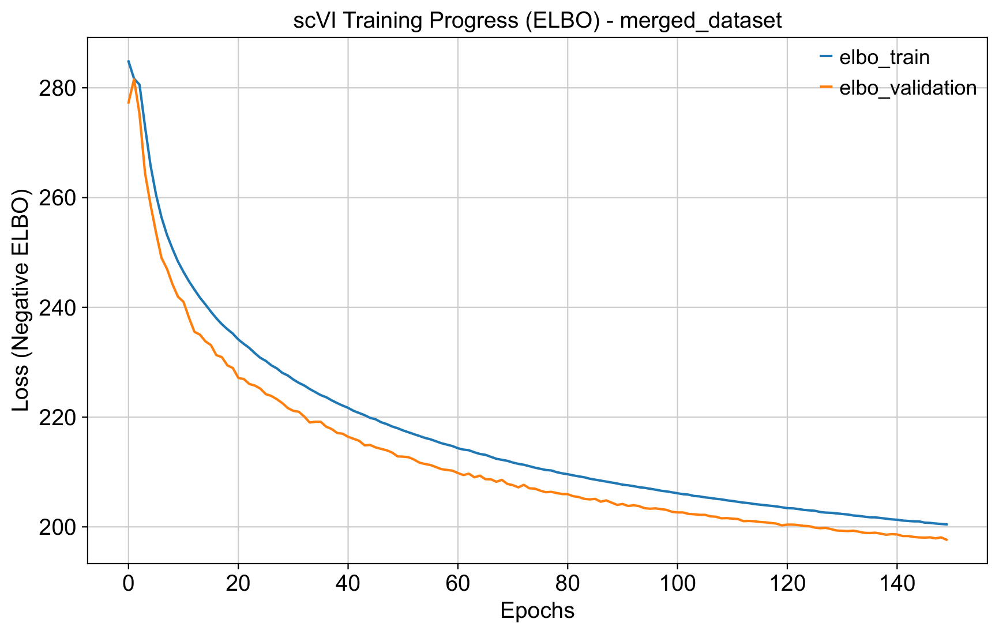
The training history plot shows:
- **ELBO (Evidence Lower Bound) decreasing steadily** from ~280 to ~200 over 150 epochs
- **Training and validation curves tracking closely** (no overfitting)
- **Plateau reached around epoch 120-140** → model converged successfully

**Interpretation:** The model learned meaningful latent representations without overfitting. Convergence indicates that 150 epochs was sufficient.

### 2.5 Latent Variance Analysis

**Figure:** `figures/integration/merged_dataset_latent_variance.pdf`

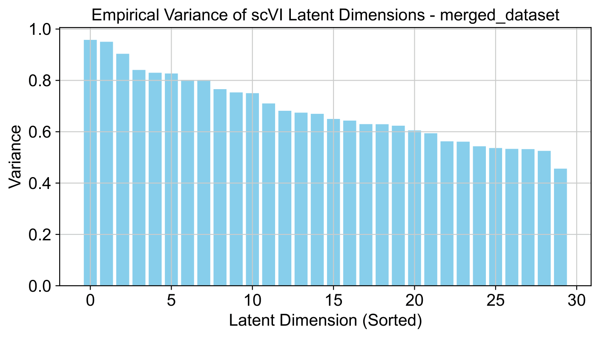

We ordered each latent component from largest variance to smallest:

- **First 5-10 components:** Capture the majority of biological signal
- **Components 11-25:** Decreasing variance, representing finer biological distinctions
- **Components 26-30:** Low to zero variance → represent noise

**Interpretation:** 30 latent dimensions is appropriate because:
- Enough dimensions to capture complex cancer heterogeneity
- Additional dimensions beyond 30 contribute minimal variance
- Avoids overfitting by excluding noise dimensions

### 2.6 Post-Integration: Batch Correction Assessment

**Figure:** `figures/integration/umap_merged_dataset_Post-Integration Composition.pdf`


After scVI integration, the UMAP shows:

| Feature | Pre-Integration | Post-Integration |
|---------|-----------------|------------------|
| Patient separation | Clear separation by batch | Well-mixed across patients |
| Condition mixing | Minimal | Clear biological grouping |
| Batch effect | Strong | Substantially reduced |

**Interpretation:** 
- Cells from different patients are now **well-mixed** within biologically meaningful cell types
- Normal, Tumor, and Metastasis samples show distinct but overlapping distributions
- Batch correction was successful without over-correction (patients are mixed but not perfectly overlapping, preserving true biological differences)

### 2.7 Leiden Resolution Optimization

**Figure:** `figures/integration/umap_merged_dataset_leiden_resolution_optimization_Optimization of Leiden Clustering Resolutions for Cell-Type Identification.pdf`


We evaluated Leiden clustering at multiple resolutions (0.25 - 1.0):

| Resolution | Cluster Count | Best For |
|------------|---------------|----------|
| 0.25 | ~8-12 clusters | Major lineages (immune, stromal, epithelial) |
| **0.5 (selected)** | **~18 clusters** | **Cell-type level annotation** |
| 0.75-1.0 | ~20-23 clusters | Cell subtypes (e.g., T cell subsets) |

**Why we chose resolution 0.5:**
- Balances granularity with statistical power
- Produces a biologically interpretable number of clusters
- Avoids over-splitting cell types that share similar functions
- Each cluster contains enough cells for reliable marker gene detection

### 2.8 Summary

| Step | Finding | Status |
|------|---------|--------|
| Pre-integration batch effect | Strong separation by patient | ✅ Need correction |
| scVI training | Converged after 150 epochs | ✅ Successful |
| Latent dimensions | 30 dimensions appropriate | ✅ Optimal |
| Post-integration mixing | Well-mixed by condition | ✅ Successful |
| Leiden resolution | 0.5 selected | ✅ Ready for annotation |

The integrated dataset is now ready for cluster characterization and cell type annotation.

---

## 3. Cell Type Annotation Interpretation

### 3.1 Dot Plot Interpretation

**Figure:** `figures/cluster_characterization/dotplot__merged_dataset_post_integration_filtered_leiden_res_0.5.pdf`


**Reading the dot plot:**
- **Dot size:** Percentage of cells expressing the gene in that cluster
- **Dot color (intensity):** Average expression level (scaled across clusters)
- **Rows:** Clusters (0-17)
- **Columns:** Top marker genes

### 3.2 Cell Type Annotation: Markers and Rationale

| Cluster | Cell Type | Key Markers | Reasoning
| --- | --- | --- | --- |
| 0 | C1QA_Macro | $C1QA$, $CD14$, $AIF1$, $HLA-DRA$, $MS4A7$ |Co-expression of complement components ($C1QA$) with macrophage markers ($CD14$, $AIF1$, $MS4A7$) and antigen presentation genes ($HLA-DRA$) defines resident-like macrophages characteristic of tissue-associated myeloid populations [^1][^2][^3][^4][^5].
| 1 | Malig_Entero | $CEACAM5$, $KRT20$, $EPCAM$, $CLDN4$, $LGALS4$ | The co-expression of epithelial structural markers ($EPCAM$, $CLDN4$) together with colorectal differentiation markers ($KRT20$, $LGALS4$) and tumor-associated antigen $CEACAM5$ defines a differentiated colorectal epithelial/tumor cell population consistent with enterocyte-like malignant cells [^6] [^7] [^8] [^9] [^10].
| 2 | Treg | $FOXP3$, $CTLA4$, $IL2RA$, $TIGIT$, $BATF$, $TNFRSF18$ | Co-expression of the lineage-defining transcription factor $FOXP3$ with immunosuppressive receptors ($CTLA4$, $TIGIT$, $IL2RA$) and activation-associated factors defines regulatory T cells enriched in tumor microenvironments [^11] [^12] [^13] [^14].
| 3 | CTL | $GZMA$, $NKG7$, $IFNG$, $CCL5$, $CD3E$, $KLRD1$ | Expression of T-cell receptor complex component $CD3E$ together with cytotoxic effector genes ($GZMA$, $NKG7$, $IFNG$) and chemokine $CCL5$ defines activated cytotoxic T lymphocytes [^15] [^16] [^17] [^18] [^19].
| 4 | Mural_Act | $ACTA2$, $TAGLN$, $MYL9$, $TPM2$, $MYLK$, $RGS5$, $CSRP2$, $ADIRF$, $NDUFA4L2$ | Co-expression of contractile smooth muscle genes ($ACTA2$, $TAGLN$, $MYL9$, $TPM2$, $MYLK$) with mural cell marker $RGS5$ defines a vascular mural lineage. The presence of $NDUFA4L2$ indicates hypoxia-driven transcriptional adaptation within the tumor microenvironment. The combined signature reflects activated mural cells with mixed pericyte/vSMC-like features involved in tumor vascular remodeling [^20] [^21] [^22] [^23] [^24] [^25].
| 5 | Neutro | $S100A8$, $S100A9$, $CSF3R$, $FCGR3B$, $CXCL8$ | High expression of inflammatory alarmins ($S100A8$, $S100A9$) together with neutrophil receptors ($CSF3R$, $FCGR3B$) and chemokine $CXCL8$ defines tumor-associated neutrophils [^26] [^27] [^28] [^29].
| 6 | Endo | $PECAM1$, $VWF$, $PLVAP$, $RAMP2$, $ACKR1$ | Co-expression of endothelial junction marker $PECAM1$ with vascular function genes ($VWF$, $PLVAP$, $ACKR1$, $RAMP2$) defines blood endothelial cells involved in vascular transport and permeability [^30] [^31] [^32] [^33] [^34].
| 7 | iCAF | $COL1A1$, $CCDC80$, $COL6A3$, $FN1$, $C1R$, $C1S$ | High expression of extracellular matrix structural genes ($COL1A1$, $COL6A3$, $FN1$) together with the activation marker $CCDC80$ defines activated inflammatory cancer-associated fibroblasts (iCAFs) [^35] [^36] [^37] [^38]. This secretory cluster is characterized by high ECM remodeling activity and pro-inflammatory signaling—supported by complement factor expression ($C1R$, $C1S$)—which collectively modulates the tumor microenvironment and immune landscape [^39].
| 8 | IgG_PC | $IGHG1-4$, $MZB1$, $JCHAIN$, $CD79A$, $DERL3$ | Strong expression of IgG constant region genes ($IGHG1-4$) together with plasma cell secretory machinery ($MZB1$, $DERL3$, $JCHAIN$) and residual B-lineage marker $CD79A$ defines class-switched IgG-secreting plasma cells [^40] [^41] [^42] [^43] [^44].
| 9 | kappa_PC | $IGKV4-1$, $IGKV3-20$, $IGKV3-11$, $MZB1$, $JCHAIN$, $CD79A$, $DERL3$ | Dominant expression of immunoglobulin kappa light chain variable genes ($IGKV$ family) within a plasma cell transcriptional background indicates κ light chain restriction. In the absence of heavy chain constant gene expression, isotype (IgA vs IgG) cannot be inferred from light chain data alone [^45] [^46].
| 10 | Naive_B | $MS4A1$, $VPREB3$, $CD79A/B$, $HLA-DRA$ | Expression of $MS4A1$ (CD20), B-cell receptor components ($CD79A/B$), and early B-cell marker ($VPREB3$) with antigen presentation genes ($HLA-DRA$) defines naïve/early mature B cells lacking plasma cell differentiation signals [^47] [^48].
| 11 | lambda_PC | $IGLV2-14$, $IGLV6-57$, $IGLV2-8$, $MZB1$, $JCHAIN$, $CD79A$, $DERL3$ | Dominant expression of immunoglobulin lambda light chain variable genes ($IGLV$ family) within a plasma cell program indicates λ light chain restriction. As with κ-restricted plasma cells, heavy chain isotype cannot be determined without IGH constant region expression [^49].
| 12 | LEC | $PROX1$, $LYVE1$, $CCL21$, $MMRN1$, $PECAM1$ | High expression of endothelial junction marker $PECAM1$ together with master regulator $PROX1$ and lymphatic markers ($LYVE1$, $CCL21$, $MMRN1$) defines lymphatic endothelial cells responsible for lymphatic vessel identity [^50] [^51] [^52] [^53].
| 13 | pDC | $SPIB$, $PLAC8$, $PTGDS$, $GZMB$, $HLA-DRA$ | Expression of transcription factor $SPIB$ together with antigen presentation ($HLA-DRA$) and interferon-associated genes ($GZMB$, $PLAC8$) defines plasmacytoid dendritic cells [^54] [^55] [^56]. This cluster reflects a dendritic lineage program rather than plasma cell identity.
| 14 | Mast | $TPSB2$, $TPSAB1$, $CPA3$, $KIT$, $GATA2$, $FCER1A$ | The co-expression of mast cell proteases ($TPSAB1$, $TPSB2$, $CPA3$) together with high-affinity IgE receptor components ($FCER1A$, $KIT$) and transcriptional regulator $GATA2$ defines a mature mast cell lineage [^57] [^58] [^59] [^60].
| 15 | Schwann | $PLP1$, $S100B$, $CDH19$, $MAL$, $CRYAB$ |  Expression of myelin-associated genes ($PLP1$, $MAL$) together with Schwann lineage markers ($CDH19$, $S100B$) defines Schwann cells within neural-associated stromal compartments [^61] [^62] [^63].
| 16 | Fibro_quies | $TCF21$, $SCARA5$, $CFD$ | The expression of core fibroblast lineage factors ($TCF21$) and niche-specific markers ($SCARA5$, $CFD$) defines a quiescent, adventitial fibroblast population [^64] [^65] [^66].
| 17 | Tuft | $POU2F3$, $TRPM5$, $BMX$, $AVIL$, $IL17RB$ | The presence of the tuft cell master regulator $POU2F3$ together with chemosensory signaling genes ($TRPM5$, $IL17RB$) and structural tuft markers ($AVIL$, $BMX$) defines a canonical tuft epithelial cell program with no overlap with other epithelial lineages [^67] [^68].

### 3.2 Post-Annotation Cell Type UMAP

**Figure:** `figures/cell_type_annotation/umap_merged_dataset_post_integration_final_cell_type_annotations.pdf`


The integrated UMAP visualization displays the final results of the cell type annotation process, revealing 17 distinct clusters across the epithelial, stromal, and immune compartments . The post-integration composition ensures that these clusters represent consistent biological identities across all six samples (S1–S6) rather than technical batch effects .

## 4. Pseudobulk DE Interpretation

### 4.1 Rationale for Comparisons

**Why exclude metastasis samples (n=3)?**

Metastasis samples (LM1-LM3, n=3) were excluded from pseudobulk DE analysis due to:
- **Insufficient statistical power** (3 vs 6 samples per group)
- **Lower total cell counts** per sample compared to primary tissues
- **High risk of false negatives** with small sample size

**Comparisons performed:**

| Comparison | Cell Type | Normal (n) | Tumor (n) | Biological Question |
|------------|-----------|------------|-----------|---------------------|
| **Malignant enterocytes** | Epithelial (Malig_Entero) | 6 | 6 | How do tumor cells reprogram gene expression? |
| **Macrophages** | Myeloid (C1QA_Macro) | 6 | 6 | Do TAMs acquire immunosuppressive phenotype? |

**Rationale for these two cell types:**
- **Malignant enterocytes:** Primary tumor epithelial cells directly transformed; reveals cancer cell-intrinsic pathways
- **C1QA_Macro:** Most abundant immune population in CRC; key players in tumor immune evasion

---

### 4.2 Gene Filtering (Pre-DESeq2)

**Figure:** `figures/pseudobulk/Tumor_vs_Normal_in_macrophages/Tumor_vs_Normal_in_macrophages_filter_expr.pdf`

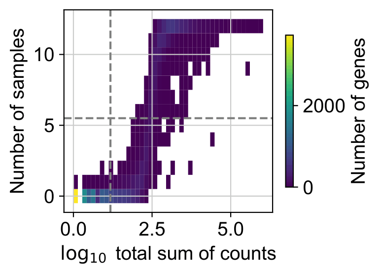

**Figure:** `figures/pseudobulk/Tumor_vs_Normal_in_macrophages/Tumor_vs_Normal_in_macrophages_filter_prop.pdf`

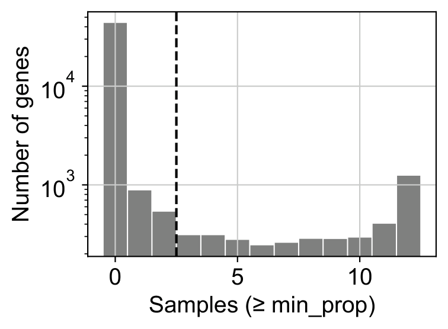

**Filtering strategy (two-step):**

| Filter | Threshold | Purpose |
|--------|-----------|---------|
| **Expression filter** | min_count=10, min_total_count=15, min_prop=0.7 | Remove genes with very low counts across samples |
| **Proportion filter** | min_prop=0.1, min_smpls=3 | Keep genes expressed in ≥10% of cells in ≥3 samples |

**Interpretation of filter plots:**
- **Filter_expr plot:** Shows log10(total counts) distribution; genes below threshold are filtered out
- **Filter_prop plot:** Vertical line indicates min_prop threshold; genes to the left (lower proportion) are removed

**For CRC dataset:** Filtering removed ~50-60% of low-expressed genes, retaining ~10,000-12,000 genes for DESeq2 analysis.

---

### 4.3 PCA Quality Control

**Figure:** `figures/pseudobulk/Tumor_vs_Normal_in_macrophages/pca_Tumor_vs_Normal_in_macrophages_pca.pdf`

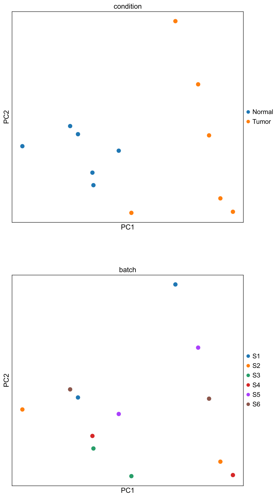

**Figure:** `figures/pseudobulk/Tumor_vs_Normal_in_enterocytes/pca_Tumor_vs_Normal_in_enterocytes_pca.pdf`

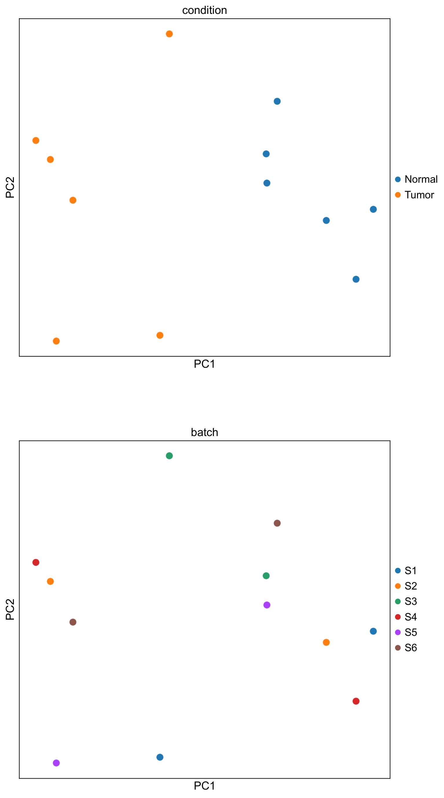

**What the PCA shows (CRC context):**

| Feature | Macrophages | Enterocytes | Interpretation |
|---------|-------------|-------------|----------------|
| **PC1 separation** | Tumor vs Normal | Tumor vs Normal | Strong biological signal - GOOD |
| **PC2 separation** | Patient-specific | Patient-specific | Expected individual variation |
| **Batch effect** | Minimal | Minimal | scVI integration successful |
| **Outliers** | None apparent | None apparent | Good sample quality |

**For macrophages:** Clear separation between Tumor and Normal along PC1 indicates tumor-associated macrophages (TAMs) have a distinct transcriptomic profile from normal tissue macrophages.

**For enterocytes:** Strong PC1 separation confirms malignant transformation induces major transcriptional reprogramming.

---

### 4.4 Volcano Plot Interpretation (CRC-Specific)

**Figure:** `figures/pseudobulk/Tumor_vs_Normal_in_macrophages/Tumor_vs_Normal_in_macrophages_volcano.pdf`

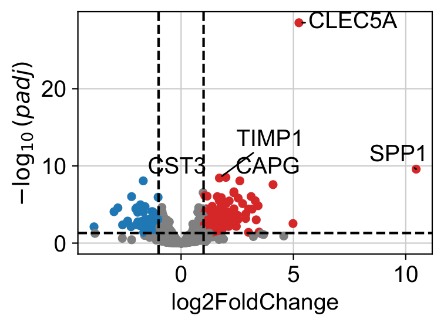

**Figure:** `figures/pseudobulk/Tumor_vs_Normal_in_enterocytes/Tumor_vs_Normal_in_enterocytes_volcano.pdf`

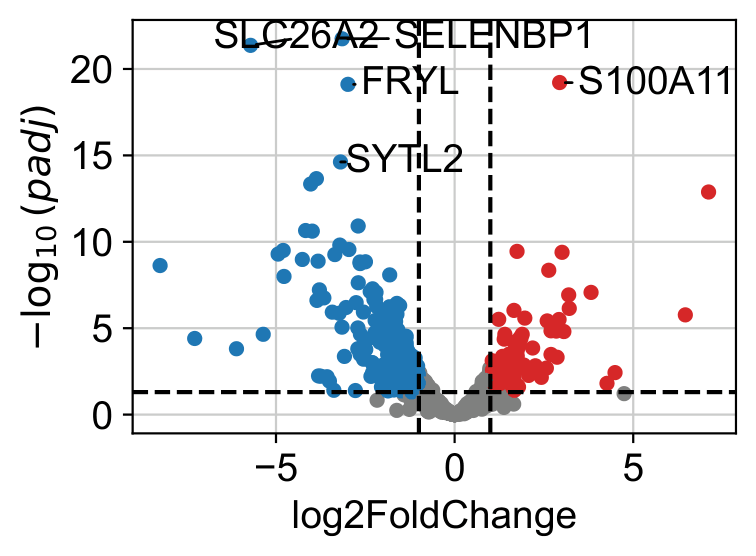

**Reading the volcano plot (CRC context):**
- **X-axis:** log2 Fold Change (Tumor vs Normal)
  - Positive (right): Upregulated in CRC
  - Negative (left): Downregulated in CRC
- **Y-axis:** -log10(padj) (higher = more statistically significant)
- **Colored points:** padj < 0.05 AND |log2FC| > 1 (significant DE genes)

#### 4.4.1 Malignant Enterocytes: Findings in CRC from Volcano plot

| Gene | Direction | Reasoning |
|------|-----------|-----------|
| **SELENBP1** | Down in Tumor | Selenium-binding protein 1 acts as a tumor suppressor in colorectal cancer. Its loss enables proliferation and is associated with poor prognosis. [^69] |
| **SLC26A2** | Down in Tumor | A sulfate transporter essential for normal colonocyte function. Downregulation reflects loss of differentiated epithelial identity in malignant cells [^70]. |
| **S100A11** | Up in Tumor | Calcium-binding protein that promotes cell migration, invasion, and metastasis. Overexpression in CRC correlates with advanced stage [^71]. |
| **FRYL** | Down in Tumor | Transcriptional regulator involved in cell cycle control and tissue polarity [^72]. Its significant downregulation in malignant enterocytes suggests a loss of homeostatic regulation. This reduction may effectively release 'proliferative brakes,' allowing cells to bypass normal developmental checkpoints and contributing to the uncontrolled growth characteristic of colorectal cancer. |
| **SYTL2** | Down in Tumor | Involved in vesicle trafficking and membrane remodeling; its downregulation suggests a profound disruption of cellular organization. This disturbance likely contributes to the loss of apico-basal polarity and the breakdown of the specialized brush border, transitions that facilitate the shift from a differentiated homeostatic state to a migratory and proliferative malignant phenotype. |


#### 4.4.2 Macrophages (TAMs): Findings in CRC from Volcano plot

| Gene | Direction | Reasoning |
|------|-----------|-----------|
| **CLEC5A** | Up in Tumor | C-type lectin receptor highly expressed on activated myeloid cells. Upregulation in tumor-associated macrophages drives pro-inflammatory cytokine production and supports tumor progression [^73]. |
| **SPP1** | Up in Tumor | Osteopontin – a secreted cytokine that promotes immunosuppression, angiogenesis, and metastasis. A well-established marker of protumoral TAMs in CRC [^74]. |
| **CAPG** | Up in Tumor | Actin-capping protein that regulates macrophage motility and infiltration into tumor tissue. Higher expression enables TAM accumulation in the tumor microenvironment [^75]. |
| **TIMP1** | Up in Tumor | Tissue inhibitor of metalloproteinases 1 – promotes tumor growth, inhibits apoptosis, and skews macrophages toward an M2-like protumoral state [^76] [^77]. |
| **CST3** | Down in Tumor | Cystatin C – a cysteine protease inhibitor. Downregulation in TAMs may increase protease activity, facilitating matrix degradation and immune cell invasion through tissues [^78]. |

---
## 5. GSEA Interpretation

### 5.1 GSEA Bar Plot (Malignant Enterocytes)

**Figure:** `figures/gsea/Tumor_vs_Normal_in_enterocytes_gsea_gsea.pdf`

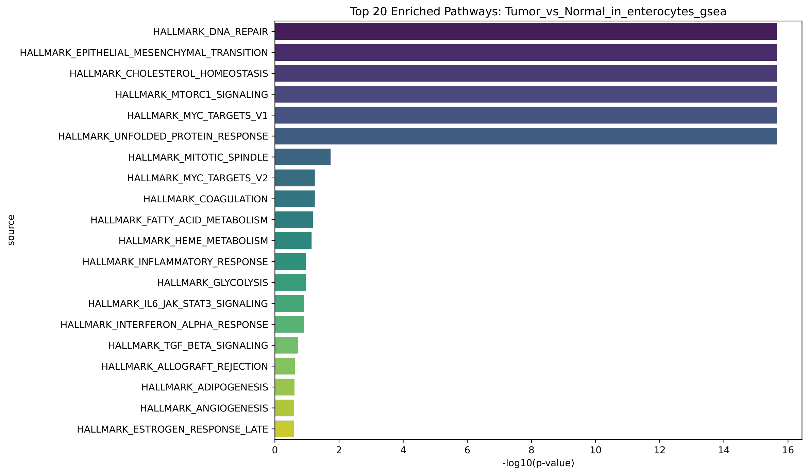

**Top enriched pathways in Malignant Enterocytes (Tumor vs Normal):**

From the bar plot, the most significant pathways include:

| Pathway | Direction | Biological Interpretation |
|---------|-----------|---------------------------|
| **HALLMARK_DNA_REPAIR** | Up in Tumor | Malignant enterocytes undergo rapid genomic replication to sustain tumor growth. High expression of DNA repair genes is a compensatory mechanism to manage replication stress and prevent apoptosis despite high mutation rates. |
| **HALLMARK_EPITHELIAL_MESENCHYMAL_TRANSITION** | Up in Tumor | Cells lose their rigid structure and gain migratory properties. This allows malignant enterocytes to invade the basement membrane and promotes metastasis to distant organs like the liver. |
| **HALLMARK_CHOLESTEROL_HOMEOSTASIS** | Up in Tumor | Enhanced lipid synthesis is required for the construction of new cell membranes during rapid proliferation. Cholesterol also stabilizes membrane "lipid rafts" that facilitate oncogenic signaling. |
| **HALLMARK_MTORC1_SIGNALING** | Up in Tumor | Acts as a master regulator of protein synthesis and anabolic metabolism. It senses nutrient availability to fuel the biomass accumulation required for continuous cancer cell growth. |
| **HALLMARK_MYC_TARGETS_V1** | Up in Tumor | Downstream of Wnt/$\beta$-catenin signaling (often due to $APC$ loss), MYC acts as a master transcriptional amplifier that orchestrates ribosomal biogenesis, metabolic rewiring, and rapid cell cycle entry. |
| **HALLMARK_UNFOLDED_PROTEIN_RESPONSE** | Up in Tumor | Triggered by excessive protein synthesis and ER stress within the tumor microenvironment. This pathway allows malignant cells to resolve protein folding backlogs and maintain proteostasis to prevent stress-induced apoptosis. |

**Summary for Malignant Enterocytes:**  
The GSEA profile of malignant enterocytes reveals a sophisticated survival strategy characterized by **oncogenic transcriptional hijacking** and **metabolic adaptation**. Driven by $APC$ loss and subsequent **MYC** amplification, these cells prioritize rapid biomass accumulation—supported by heightened **MTORC1 signaling** and **cholesterol homeostasis** for membrane biogenesis. This hyper-proliferative state is shielded by an upregulated **DNA repair** machinery and the **Unfolded Protein Response (UPR)**, which allow the cells to withstand replication stress and proteotoxic backlogs that would normally trigger apoptosis. Finally, the enrichment of **EMT** markers signifies a transition toward an invasive phenotype, facilitating the breakdown of basement membranes and the eventual colonization of metastatic sites like the liver.

---

### 5.2 GSEA Bar Plot (Macrophages)

**Figure:** `figures/gsea/Tumor_vs_Normal_in_macrophages_gsea_gsea.pdf`


**Top enriched pathways in Macrophages (Tumor vs Normal):**

| Pathway | Direction | Biological Interpretation |
|---------|-----------|---------------------------|
| **HALLMARK_DNA_REPAIR** | Up in Tumor | Reflects a compensatory response to oxidative stress and ROS within the TME. Upregulation of repair machinery ensures macrophage survival and persistence. |
| **HALLMARK_EPITHELIAL_MESENCHYMAL_TRANSITION** | Up in Tumor | Reflects an "M2-like" activation state driven by TGF-$\beta$ signaling. TAMs upregulate mesenchymal-related genes to promote extracellular matrix (ECM) remodeling, which facilitates tumor cell invasion and metastasis. |
| **HALLMARK_CHOLESTEROL_HOMEOSTASIS** | Up in Tumor | Indicates metabolic reprogramming toward an M2-like, pro-tumor phenotype. Cholesterol is utilized to maintain membrane fluidity for migration and to support the anti-inflammatory signaling required for immune evasion. |
| **HALLMARK_MTORC1_SIGNALING** | Up in Tumor | Serves as a metabolic driver for M2-like polarization and immunosuppression. It orchestrates the high rate of protein synthesis required for the secretion of pro-tumorigenic cytokines and growth factors. |
| **HALLMARK_MYC_TARGETS_V1** | Up in Tumor | Acts as a master transcriptional driver of the M2-like phenotype. It coordinates the metabolic and functional reprogramming of macrophages toward a pro-tumorigenic and immunosuppressive state. |
| **HALLMARK_UNFOLDED_PROTEIN_RESPONSE** | Up in Tumor | Reflects high ER stress caused by the heavy secretory demand for pro-tumor cytokines and the accumulation of misfolded proteins in the hypoxic TME. This adaptive response is crucial for TAM survival and sustained immunosuppressive activity. |

**Summary for Macrophages (TAMs):**  
The GSEA profile of **TAMs** reveals a specialized **metabolic and functional reprogramming** optimized for survival in the aggressive tumor microenvironment. Driven by **MYC** and **MTORC1** signaling, these macrophages exhibit a high-output **secretory phenotype—supported** by an upregulated **Unfolded Protein Response (UPR)** to manage the resulting ER stress. The enrichment of **EMT** and **Cholesterol Homeostasis** genes signifies a shift toward an **immunosuppressive, M2-like state** focused on extracellular matrix remodeling and membrane flexibility for infiltration. Furthermore, the activation of **DNA Repair** pathways indicates a robust compensatory mechanism that allows these TAMs to persist and maintain their pro-tumorigenic functions despite the high oxidative stress and genomic instability typical of colorectal and metastatic liver environments.

---

## 6. Cell-Cell Communication Interpretation

### 6.1 K-Selection Plots

**Figure:** `figures/cellchat_communication/Normal_samples_annotated/k_diagnostics/Normal_samples_annotated_selectK_diagnostics.pdf`

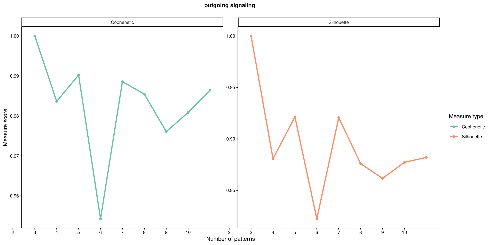

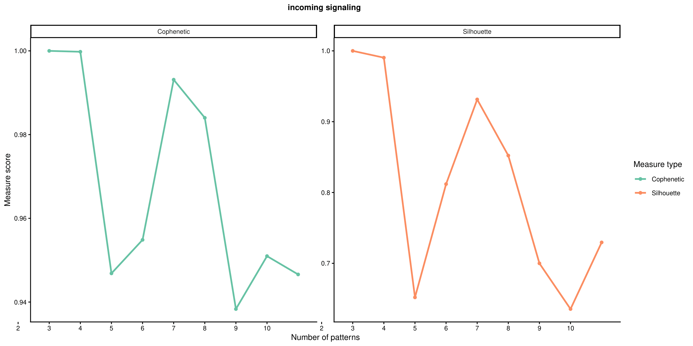

**Figure:** `figures/cellchat_communication/Normal_samples_annotated/k_diagnostics/Normal_samples_annotated_selectK_diagnostics.pdf`

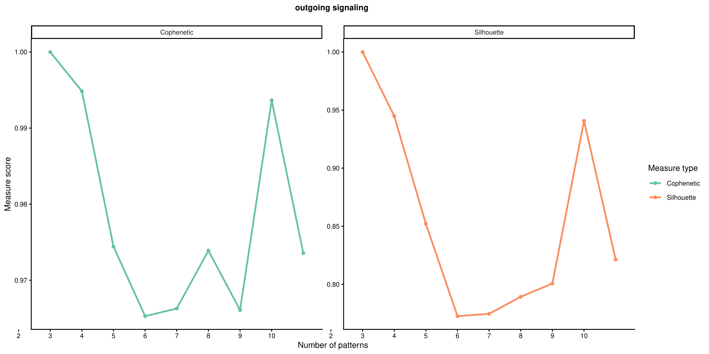

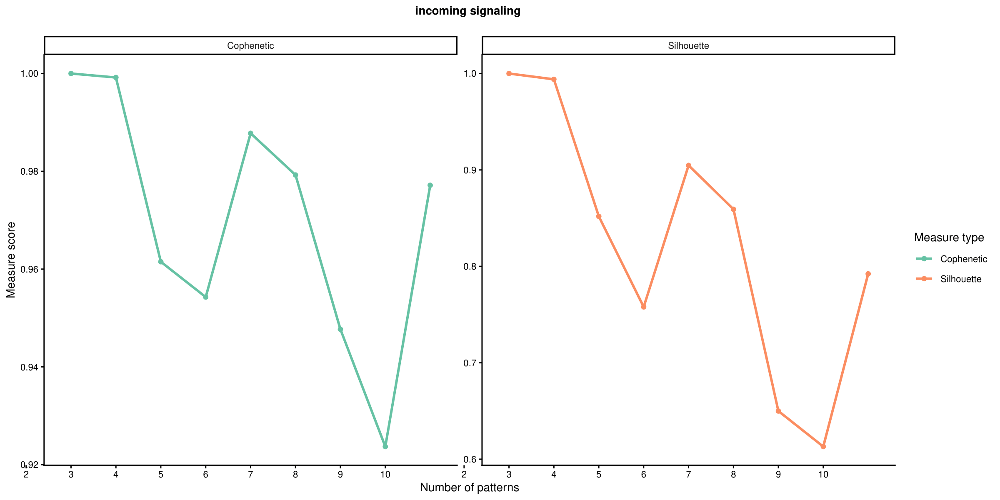

Based on the diagnostic elbow plots, the optimal number of patterns for both normal and tumor conditions was determined to capture the maximum heterogeneity without over-fitting:
* **Normal Samples:** 3 Outgoing Patterns ($k_{out}=3$), 4 Incoming Patterns ($k_{in}=4$).
* **Tumor Samples:** 4 Outgoing Patterns ($k_{out}=4$), 4 Incoming Patterns ($k_{in}=4$).


### 6.2 Comprehensive Patterns

The comprehensive heatmaps and river plots illustrate the coordination between signaling pathways and specific cell types.

#### Normal Communication (k_out: 3, k_in: 4)

**Figure:** `figures/cellchat_communication/Normal_samples_annotated/individual_patterns/Normal_samples_annotated_comprehensive_patterns.pdf` (Page 2 & 3)

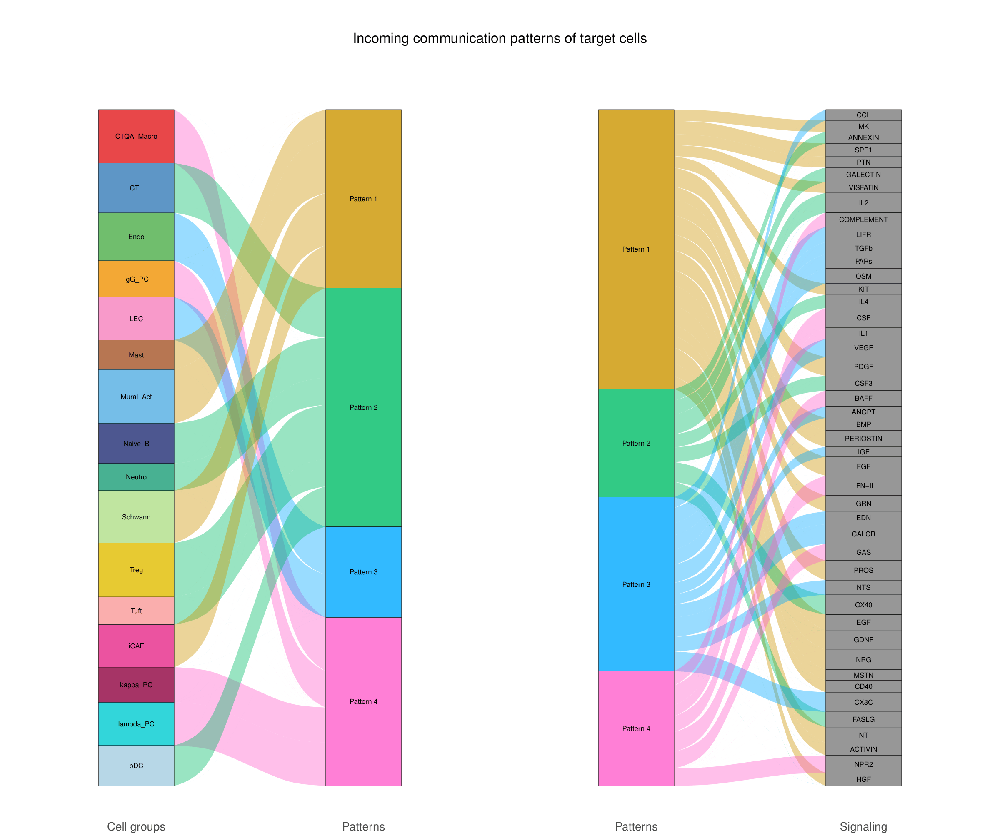


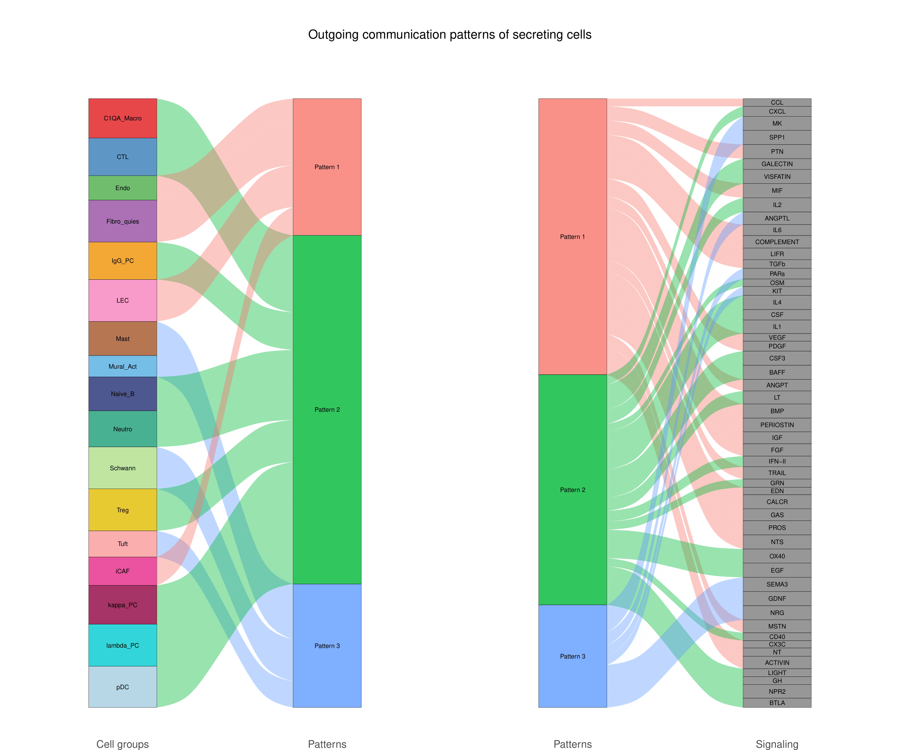

* **Outgoing (Secreting):** Pattern 1 is dominated by stromal cells like **iCAF** and **Mural_Act**, heavily contributing to pathways such as **PERIOSTIN** and **ANGPTL**. Pattern 2 is driven by immune cells (**Treg**, **CTL**) and epithelial cells (**Tuft**), primarily utilizing **ANNEXIN** and **GALECTIN**.
* **Incoming (Target):** Pattern 4 is highly specific to **pDC** and **Plasma Cells** (kappa/lambda), which are the primary targets for **ACTIVIN** and **BTLA** signaling.


#### Tumor Communication (k_out: 4, k_in: 4)

**Figure:** `figures/cellchat_communication/Tumor_samples_annotated/individual_patterns/Tumor_samples_annotated_comprehensive_patterns.pdf` (Page 2 & 3)

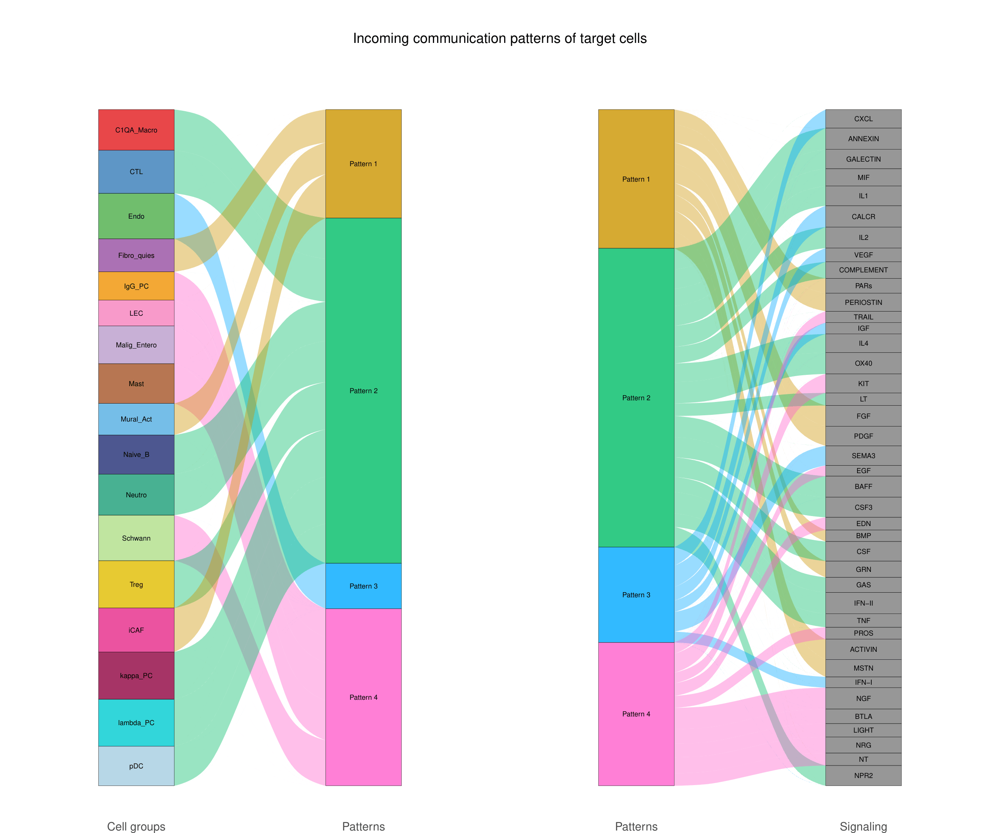


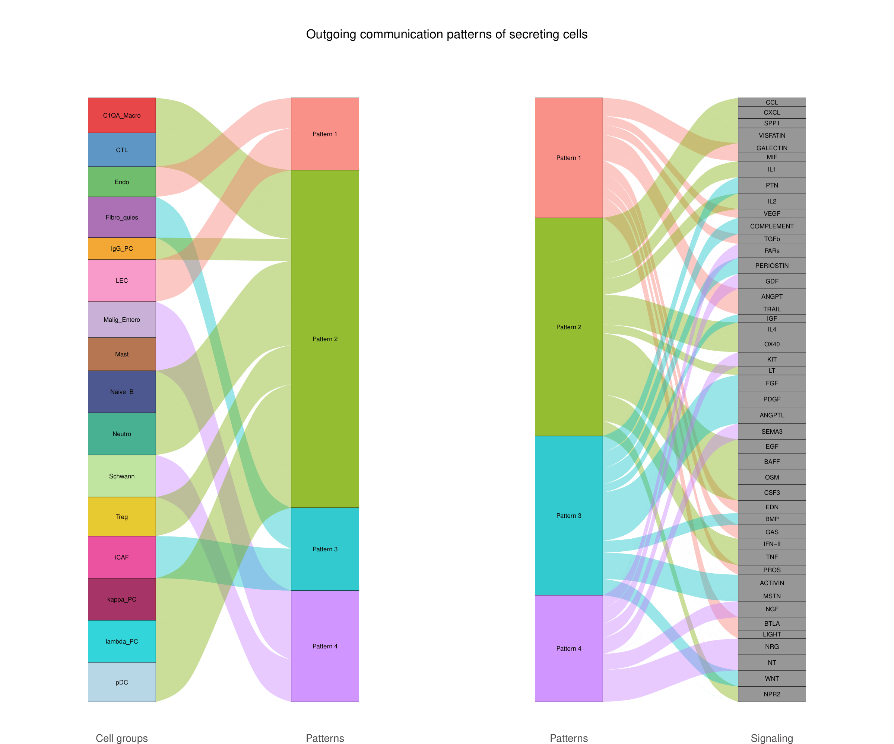

* **Outgoing (Secreting):** The tumor microenvironment shows increased complexity. **Malignant Enterocytes (Malig_Entero)** and **Mast cells** drive Pattern 2, contributing significantly to **GALECTIN**, **ANNEXIN**, and **BAFF** signaling. Pattern 4 is uniquely associated with **Schwann** cells and **Plasma Cells**, focusing on **NRG** and **WNT** pathways.
* **Incoming (Target):** **Malignant Enterocytes** and **LEC** primarily respond via Pattern 2 pathways, including **VEGF** and **TGF$\beta$**. Pattern 3 is specific to **iCAF**, acting as a major receiver for **IGF** and **PERIOSTIN**.

---
## 7. Differential Communication Interpretation

### 7.1 Global Interactions
**Figure:** `figures/cellchat_communication/differential_communication/01_global_interactions.pdf` (Page 1)

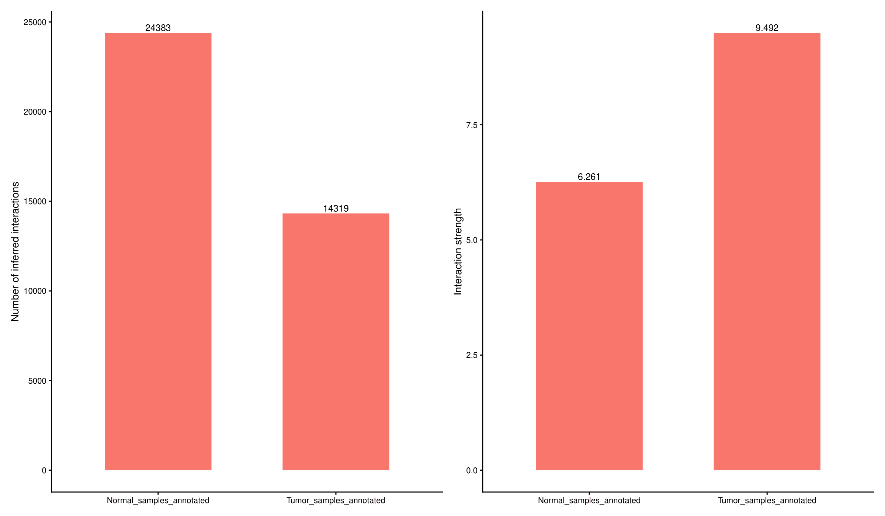

| Measure | Normal | Tumor | Interpretation |
| :--- | :--- | :--- | :--- |
| **Interaction Count** | 24,383 | 14,319 | **Decreased Count:** There are fewer unique communication events inferred in the tumor samples compared to normal tissue. |
| **Interaction Strength** | 6.261 | 9.492 | **Increased Strength:** Despite fewer total interactions, the remaining signaling pathways are significantly more intense in the tumor. |

**Summary:** The tumor microenvironment exhibits **fewer but stronger interactions**. This suggests that while overall cellular "chatter" is reduced, specific pathways are being heavily amplified, leading to a more focused and hyper-active signaling state.

### 7.2 Signaling Roles (Scatter Plot Analysis)
**Figure:** `02_signaling_roles.pdf` (Page 1)

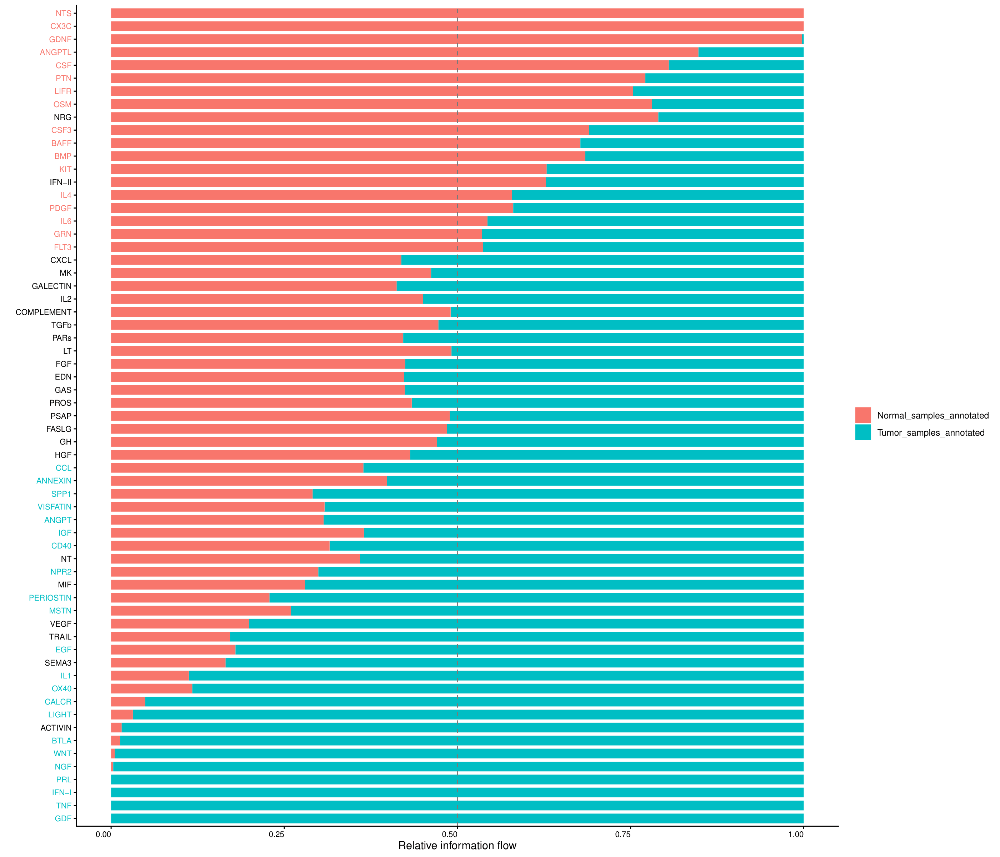

The relative information flow comparison highlights which pathways have gained or lost dominance:
* **Tumor-Enriched Hubs:** Pathways like **SPP1, MIF, GALECTIN, and MK** show the highest relative information flow in the tumor samples.
* **Normal-Enriched Hubs:** **PTN and ANGPTL** signaling are more prominent in the normal samples, suggesting a shift from homeostatic growth signaling to tumor-promoting inflammatory signaling.


### 7.3 Network Topology (Circle Plots)
**Figure:** `03_network_topology.pdf` (Page 2 to 4)

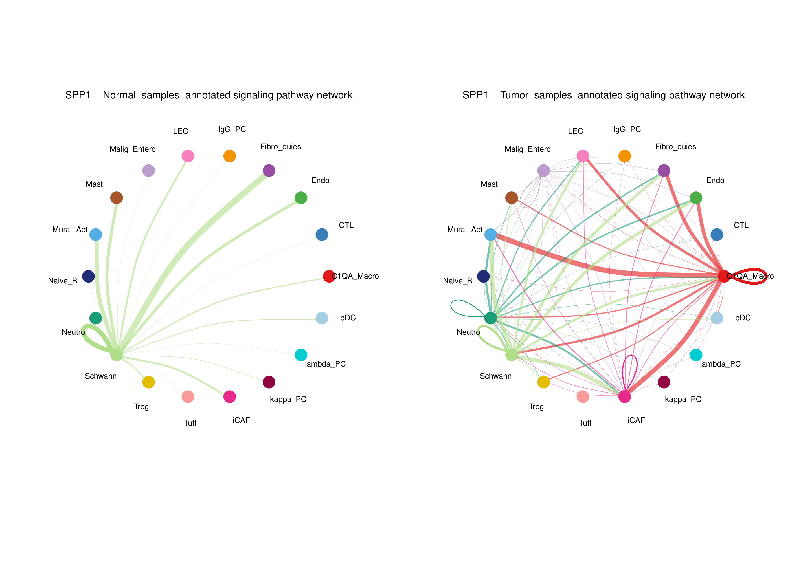

**SPP1**: In Normal samples, signaling is sparse. In **Tumor** samples, a massive signaling hub forms where **iCAFs and Macrophages** act as both major senders and receivers, creating a dense feedback loop.

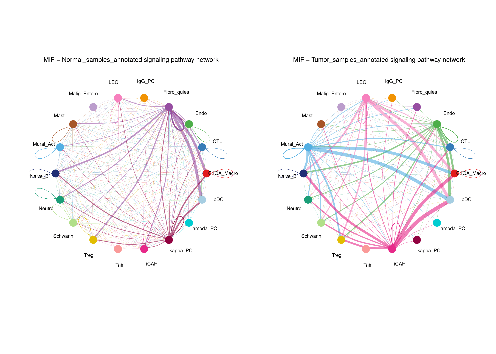

**MIF**: In Normal samples, signaling is concentrated around **quiescent fibroblasts and plasma cells**, maintaining a relatively stable homeostatic network. In **Tumor** samples, the signaling shifts dramatically toward **iCAF and Mural_Act** (activated mural cells). These cells become the primary drivers of MIF signaling in the tumor.

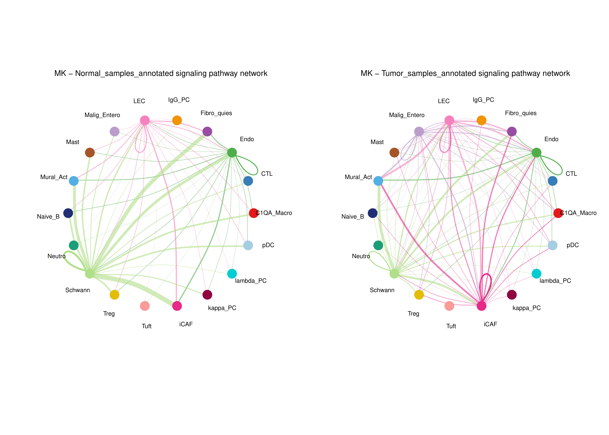

* **MK**: In Normal samples, signaling is widespread but primarily driven by **Schwann cells and Endothelial cells**, serving as the central hubs for baseline tissue maintenance. In **Tumor** samples, the signaling landscape is restructured into a high-intensity axis where **iCAFs and Malignant Enterocytes** emerge as key players. The **iCAFs** function as a massive secretion hub, while the **Malignant Enterocytes** actively participate as both senders and receivers, creating a pro-tumor circuit that drives epithelial proliferation and stroma-driven remodeling

### 7.4 Targeted Pathway Deep Dive
**Figure:** `04_pathway_deep_dive_targeted.pdf`

Detailed Ligand-Receptor (L-R) pair analysis reveals the specific molecular drivers:


#### 7.4.1 SPP1 Signaling: The CAF-Immune Axis

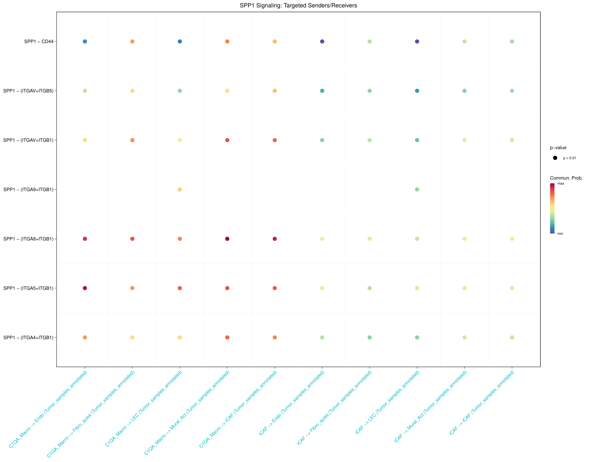

The **SPP1** pathway shows intense communication in tumor samples, primarily centered on **C1QA_Macro** and **iCAF** as the engine of signaling.

* **L-R Pair:** **SPP1 — CD44**.
* **The Link:** **C1QA_Macro** **iCAF** (Senders) $\rightarrow$ **Endo**, **LEC**, and **Fibro_quies** (Receivers).
* **Alternative Pairs:** There are strong signals for integrin-based interactions, specifically **SPP1 — (ITGA8+ITGB1)** and **SPP1 — (ITGA5+ITGB1)**.
* **Literature Context:** In colorectal cancer, the **SPP1-CD44** interaction is a classic driver of fibroblast activation and tissue remodeling. Secreted SPP1 (coming from macrophages) binds to CD44 receptors on quiescent fibroblasts, which not only induces their chemotaxis and migration but also reprograms them into activated CAFs [^79].


---

#### 7.4.2 MIF Signaling: The Immunosuppressive Hub
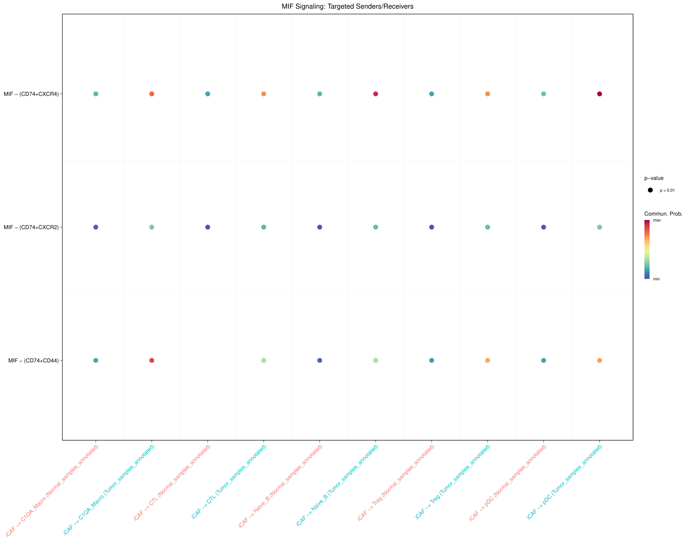

The **MIF** pathway is characterized by a broad "broadcast" pattern where **iCAF** sends signals to a wide variety of immune cells.

* **L-R Pairs:** This pathway uses three distinct complexes: **MIF — (CD74+CD44)**, **MIF — (CD74+CXCR2)**, and **MIF — (CD74+CXCR4)**.
* **The Link:** **iCAF** (Sender) $\rightarrow$ **C1QA_Macro**, **CTL**, **Naive_B**, **Treg**, and **pDC** (Receivers).
* **Interaction Strength:** The strongest probability is seen for **MIF — (CD74+CXCR4)** targeting **pDC** and **Treg**.
* **Literature Context:** iCAF-derived MIF polarizes macrophages toward an M2 immunosuppressive phenotype via **CD74/CD44**, promoting tumor growth through enhanced angiogenesis and IL-10 secretion [^80]. Furthermore, iCAFs engage pDCs via **MIF-CD74/CXCR4** to establish a pro-metastatic network [^81].

---

#### 7.4.3 MK Signaling: The Niche-to-Tumor Interaction

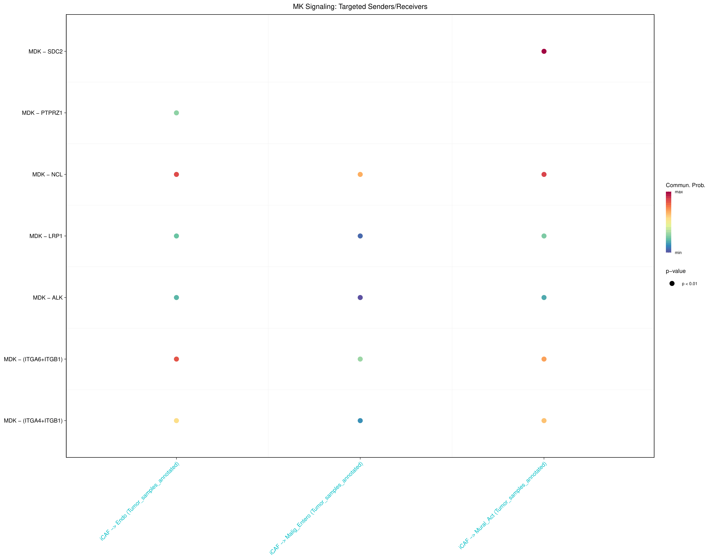
The **MK** (Midkine) signaling pathway targets the vascular system and the malignant cells directly.

* **Primary L-R Pair:** **MDK — SDC2** (Syndecan-2) and **MDK — NCL** (Nucleolin) show the highest communication probabilities.
* **The Link:** **iCAF** (Sender) $\rightarrow$ **Endo**, **Mural_Act**, and **Malig_Entero** (Receivers).
* **Alternative Pair:** **MDK — (ITGA6+ITGB1)** specifically links **iCAF** to **Endo** with high probability.
* **Literature Context:** Our analysis reveals a previously undescribed interaction between inflammatory cancer-associated fibroblasts (iCAFs) and endothelial cells mediated by the **MDK-NCL axis**. While MDK-NCL signaling has been reported in cancer cells [^82], its role in endothelial communication has not been characterized. We find that iCAF-derived MDK binds to nucleolin (NCL) on endothelial cells, suggesting a novel mechanism for MDK-driven angiogenesis and vascular remodeling.


### 7.5 Cell-Specific Differential Scatters
**Figure:** `05_cell_specific_diff_scatters.pdf`

By comparing incoming vs. outgoing signaling for individual cell types:

#### 7.5.1 Malignant Enterocytes (Malig_Entero)

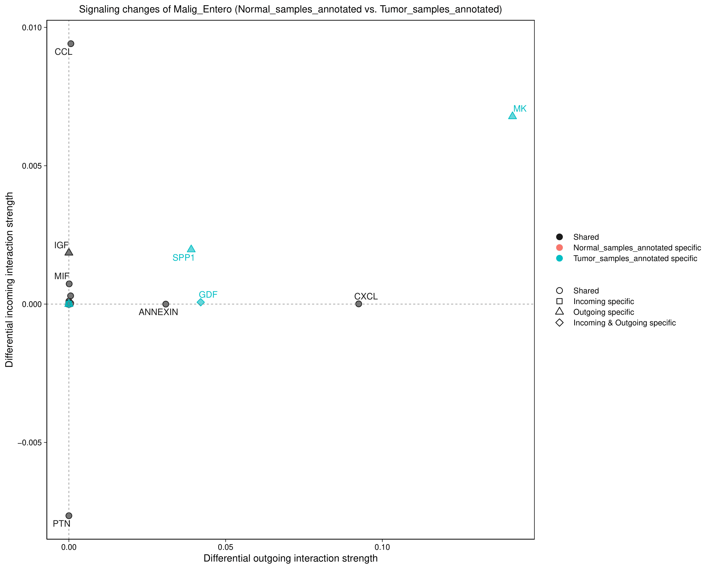

This plot captures how malignant cells shift their communication profile compared to normal enterocytes.

* **Major Gained Signals:** **MK** (Midkine) shows a significant increase in both incoming and outgoing interaction strength, positioning it in the upper-right quadrant. **SPP1** and **GDF** also show increased signaling activity specific to the tumor samples.

#### 7.5.2 Macrophages (C1QA_Macro)

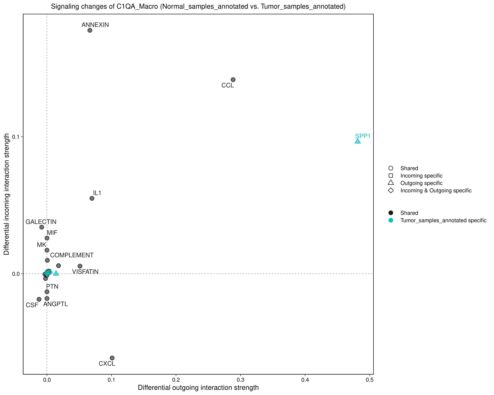

The C1QA+ Macrophage population shows a heavy bias toward outgoing signaling in the tumor microenvironment.
* **Dominant Outgoing Signal:** **SPP1** is positioned far to the right, indicating a massive increase in outgoing interaction strength. This suggests macrophages are a primary source of SPP1 signaling in the tumor.


#### 7.5.3 Inflammatory Cancer-Associated Fibroblasts (iCAF)

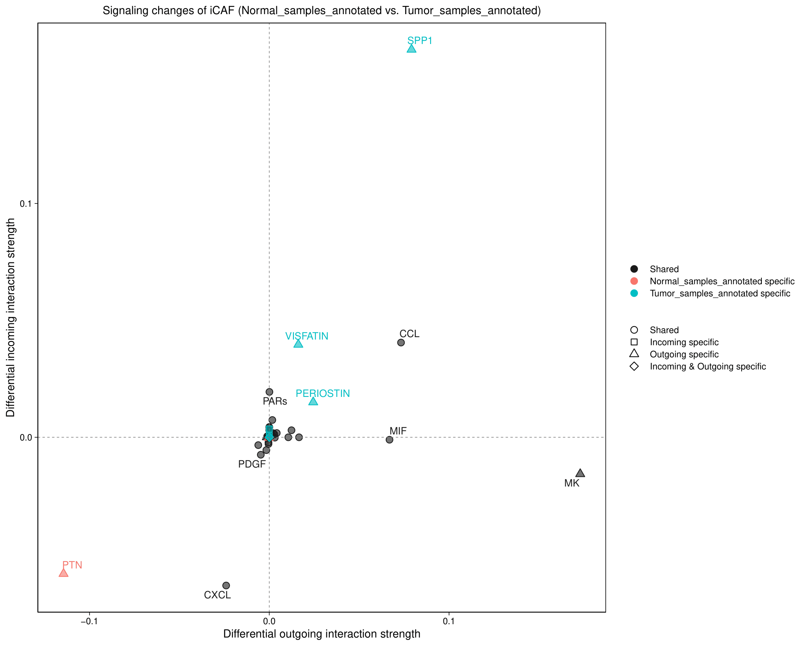
The iCAF population exhibits specialized signaling shifts related to the extracellular matrix and growth factors.
* **Incoming vs. Outgoing Balance:** **SPP1** shows the highest differential incoming strength for these cells.

---

### References

[^1]: Zhang, L., Li, Z., Skrzypczynska, K. M., Fang, Q., Zhang, W., O’Brien, S. A., He, Y., Wang, L., Zhang, Q., Kim, A., Gao, R., Orf, J., Wang, T., Sawant, D., Kang, J., Bhatt, D., Lu, D., Li, C.-M., Rapaport, A. S., … Yu, X. (2020). Single-Cell Analyses Inform Mechanisms of Myeloid-Targeted Therapies in Colon Cancer. Cell, 181(2), 442-459.e29. https://doi.org/10.1016/j.cell.2020.03.048

[^2]: Daghestani, H. N., Pieper, C. F., & Kraus, V. B. (2015). Soluble macrophage biomarkers indicate inflammatory phenotypes in patients with knee osteoarthritis. Arthritis & rheumatology (Hoboken, N.J.), 67(4), 956–965. https://doi.org/10.1002/art.39006

[^3]: Donovan, K. M., Leidinger, M. R., McQuillen, L. P., Goeken, J. A., Hogan, C. M., Harwani, S. C., Flaherty, H. A., & Meyerholz, D. K. (2018). Allograft Inflammatory Factor 1 as an Immunohistochemical Marker for Macrophages in Multiple Tissues and Laboratory Animal Species. Comparative medicine, 68(5), 341–348. https://doi.org/10.30802/AALAS-CM-18-000017


[^4]: Tan Q, Liu H, Xu J, Mo Y, Dai F. Integrated analysis of tumor-associated macrophage infiltration and prognosis in ovarian cancer. Aging (Albany NY). 2021; 13:23210-23232. https://doi.org/10.18632/aging.203613


[^5]: Jiang Fen Li, Yu Fang Xie, Wei Hua Liang et al. HLA-DR regulates macrophage phenotypic transformation and affects malignant behavior in esophageal squamous cell carcinoma, 03 August 2020, PREPRINT (Version 1) available at Research Square [https://doi.org/10.21203/rs.3.rs-49282/v1]

[^6]: Keller, L., Werner, S., & Pantel, K. (2019). Biology and clinical relevance of EpCAM. Cell stress, 3(6), 165–180. https://doi.org/10.15698/cst2019.06.188

[^7]: Fujiwara-Tani, R., Mori, S., Ogata, R., Sasaki, R., Ikemoto, A., Kishi, S., Kondoh, M., & Kuniyasu, H. (2023). Claudin-4: A New Molecular Target for Epithelial Cancer Therapy. International journal of molecular sciences, 24(6), 5494. https://doi.org/10.3390/ijms24065494

[^8]: Harbaum, L., Pollheimer, M. J., Kornprat, P., Lindtner, R. A., Schlemmer, A., Rehak, P., & Langner, C. (2012). Keratin 20 - a diagnostic and prognostic marker in colorectal cancer?. Histology and histopathology, 27(3), 347–356. https://doi.org/10.14670/HH-27.347


[^9]: Satelli, A., Rao, P. S., Thirumala, S., & Rao, U. S. (2011). Galectin-4 functions as a tumor suppressor of human colorectal cancer. International journal of cancer, 129(4), 799–809. https://doi.org/10.1002/ijc.25750


[^10]: Zhu, X. Y., Li, Q. X., Kong, Y., Huang, K. K., Wang, G., Wang, Y. J., Lu, J., Hua, G. Q., Wu, Y. L., & Ying, T. L. (2024). A novel human single-domain antibody-drug conjugate targeting CEACAM5 exhibits potent in vitro and in vivo antitumor activity. Acta pharmacologica Sinica, 45(3), 609–618. https://doi.org/10.1038/s41401-023-01200-9

[^11]: Zheng, Y., Rudensky, A. Foxp3 in control of the regulatory T cell lineage. Nat Immunol 8, 457–462 (2007). https://doi.org/10.1038/ni1455

[^12]: Peter S. Linsley et al. ,Immunosuppression in Vivo by a Soluble Form of the CTLA-4 T Cell Activation Molecule.Science257,792-795(1992). https://doi.org/10.1126/science.1496399

[^13]: Zhang, C., Wang, Y., Xun, X., Wang, S., Xiang, X., Hu, S., Cheng, Q., Guo, J., Li, Z., & Zhu, J. (2020). TIGIT Can Exert Immunosuppressive Effects on CD8+ T Cells by the CD155/TIGIT Signaling Pathway for Hepatocellular Carcinoma In Vitro. Journal of immunotherapy (Hagerstown, Md. : 1997), 43(8), 236–243. https://doi.org/10.1097/CJI.0000000000000330

[^14]: Chinen, T., Kannan, A. K., Levine, A. G., Fan, X., Klein, U., Zheng, Y., Gasteiger, G., Feng, Y., Fontenot, J. D., & Rudensky, A. Y. (2016). An essential role for the IL-2 receptor in Treg cell function. Nature immunology, 17(11), 1322–1333. https://doi.org/10.1038/ni.3540

[^15]: Wong, ML., Dong, C., Maestre-Mesa, J. et al. Polymorphisms in inflammation-related genes are associated with susceptibility to major depression and antidepressant response. Mol Psychiatry 13, 800–812 (2008). https://doi.org/10.1038/mp.2008.59

[^16]: Lieberman J. (2010). Granzyme A activates another way to die. Immunological reviews, 235(1), 93–104. https://doi.org/10.1111/j.0105-2896.2010.00902.x

[^17]: Turiello, R., Ng, S. S., Tan, E., van der Voort, G., Salim, N., Yong, M. C. R., Khassenova, M., Oldenburg, J., Rühl, H., Hasenauer, J., Surace, L., Toma, M., Bald, T., Hölzel, M., & Corvino, D. (2025). NKG7 is a Stable Marker of Cytotoxicity Across Immune Contexts and Within the Tumor Microenvironment. European journal of immunology, 55(6), e51885. https://doi.org/10.1002/eji.202551885

[^18]: Gray, P. W., & Goeddel, D. V. (1982). Structure of the human immune interferon gene. Nature, 298(5877), 859–863. https://doi.org/10.1038/298859a0


[^19]: Zumwalt, T. J., Arnold, M., Goel, A., & Boland, C. R. (2015). Active secretion of CXCL10 and CCL5 from colorectal cancer microenvironments associates with GranzymeB+ CD8+ T-cell infiltration. Oncotarget, 6(5), 2981–2991. https://doi.org/10.18632/oncotarget.3205

[^20]: Beamish, J. A., He, P., Kottke-Marchant, K., & Marchant, R. E. (2010). Molecular regulation of contractile smooth muscle cell phenotype: implications for vascular tissue engineering. Tissue engineering. Part B, Reviews, 16(5), 467–491. https://doi.org/10.1089/ten.TEB.2009.0630

[^21]: Moreno, C. A., Sobreira, N., Pugh, E., Zhang, P., Steel, G., Torres, F. R., & Cavalcanti, D. P. (2018). Homozygous deletion in MYL9 expands the molecular basis of megacystis-microcolon-intestinal hypoperistalsis syndrome. European journal of human genetics : EJHG, 26(5), 669–675. https://doi.org/10.1038/s41431-017-0055-5

[^22]: Shen, B., Gong, Y., Xu, Y., Ling, Q., Huang, R., & Jia, X. (2025). TPM2 regulates contractility and biomechanical properties in trabecular meshwork cells. Scientific reports, 15(1), 41108. https://doi.org/10.1038/s41598-025-24993-7

[^23]: Lazar, V., & Garcia, J. G. (1999). A single human myosin light chain kinase gene (MLCK; MYLK). Genomics, 57(2), 256–267. https://doi.org/10.1006/geno.1999.5774

[^24]: Li, ZJ., Ganss, R. (2018). Regulator of G Protein Signaling 5 (RGS5). In: Choi, S. (eds) Encyclopedia of Signaling Molecules. Springer, Cham. https://doi.org/10.1007/978-3-319-67199-4_101794

[^25]: Ye, N., Wang, Y., Jiang, P., Jiang, H., Ding, W., Zhang, Z., & Xi, C. (2023). Hypoxia-induced the upregulation of NDUFA4L2 promoted colon adenocarcinoma progression through ROS-mediated PI3K/AKT pathway. Cytotechnology, 75(6), 461–472. https://doi.org/10.1007/s10616-023-00590-2

[^26]: Vogl, T., Eisenblätter, M., Völler, T., Zenker, S., Hermann, S., van Lent, P., Faust, A., Geyer, C., Petersen, B., Roebrock, K., Schäfers, M., Bremer, C., & Roth, J. (2014). Alarmin S100A8/S100A9 as a biomarker for molecular imaging of local inflammatory activity. Nature communications, 5, 4593. https://doi.org/10.1038/ncomms5593

[^27]: Liongue, C., Wright, C., Russell, A. P., & Ward, A. C. (2009). Granulocyte colony-stimulating factor receptor: stimulating granulopoiesis and much more. The international journal of biochemistry & cell biology, 41(12), 2372–2375. https://doi.org/10.1016/j.biocel.2009.08.011

[^28]: Tsuboi, N., Asano, K., Lauterbach, M., & Mayadas, T. N. (2008). Human neutrophil Fcgamma receptors initiate and play specialized nonredundant roles in antibody-mediated inflammatory diseases. Immunity, 28(6), 833–846. https://doi.org/10.1016/j.immuni.2008.04.013


[^29]: Gales, Dominique, Clark, Clarence, Manne, Upender, Samuel, Temesgen, The Chemokine CXCL8 in Carcinogenesis and Drug Response, International Scholarly Research Notices, 2013, 859154, 8 pages, 2013. https://doi.org/10.1155/2013/859154


[^30]: Privratsky, J. R., & Newman, P. J. (2014). PECAM-1: regulator of endothelial junctional integrity. Cell and tissue research, 355(3), 607–619. https://doi.org/10.1007/s00441-013-1779-3


[^31]: Liu, J., Yuan, L., Molema, G., Regan, E., Janes, L., Beeler, D., Spokes, K. C., Okada, Y., Minami, T., Oettgen, P., & Aird, W. C. (2011). Vascular bed-specific regulation of the von Willebrand factor promoter in the heart and skeletal muscle. Blood, 117(1), 342–351. https://doi.org/10.1182/blood-2010-06-287987

[^32]: Denzer, L., Muranyi, W., Schroten, H., & Schwerk, C. (2023). The role of PLVAP in endothelial cells. Cell and tissue research, 392(2), 393–412. https://doi.org/10.1007/s00441-023-03741-1

[^33]: Crawford, K. S., & Volkman, B. F. (2023). Prospects for targeting ACKR1 in cancer and other diseases. Frontiers in immunology, 14, 1111960. https://doi.org/10.3389/fimmu.2023.1111960

[^34]: Tanaka, M., Koyama, T., Sakurai, T., Kamiyoshi, A., Ichikawa-Shindo, Y., Kawate, H., Liu, T., Xian, X., Imai, A., Zhai, L., Hirabayashi, K., Owa, S., Yamauchi, A., Igarashi, K., Taniguchi, S., & Shindo, T. (2016). The endothelial adrenomedullin-RAMP2 system regulates vascular integrity and suppresses tumour metastasis. Cardiovascular research, 111(4), 398–409. https://doi.org/10.1093/cvr/cvw166

[^35]: Devos, H., Zoidakis, J., Roubelakis, M. G., Latosinska, A., & Vlahou, A. (2023). Reviewing the Regulators of COL1A1. International journal of molecular sciences, 24(12), 10004. https://doi.org/10.3390/ijms241210004

[^36]: Robert B West, Brian P Rubin, Melinda A Miller, et al. A landscape effect in tenosynovial giant-cell tumor from activation of CSF1 expression by a translocation in a minority of tumor cells. Proc Natl Acad Sci U S A (2006) https://doi.org/10.1073/pnas.0507321103

[^37]: Li X, Chen R, Kemper S and Brigstock DR (2021) Structural and Functional Characterization of Fibronectin in Extracellular Vesicles From Hepatocytes. Front. Cell Dev. Biol. 9:640667. doi: 10.3389/fcell.2021.640667

[^38]: Mo, S., Wang, Y., Xiong, R., Ma, L., Xu, M., Wang, L., & Gu, W. (2026). Spatially defined danger zone shapes gastric cancer progression through CCDC80+ fibroblast-induced CD8+ T cell dysfunction. Apoptosis : an international journal on programmed cell death, 31(3), 91. https://doi.org/10.1007/s10495-026-02287-1

[^39]: Pal, P., Wahi, P., Sahu, A. and Lal, G. (2025), Pro- and Anti-Inflammatory Role of Complement in Cancer. Eur. J. Immunol., 55: e51767. https://doi.org/10.1002/eji.202451767

[^40]: Bashirova, A.A., Zheng, W., Akdag, M. et al. Population-specific diversity of the immunoglobulin constant heavy G chain (IGHG) genes. Genes Immun 22, 327–334 (2021). https://doi.org/10.1038/s41435-021-00156-2

[^41]: Zhang, Y., Yang, W., Yang, X., Pan, Y., Guo, R., Chen, D., Tang, S., & Zhang, X. (2026). MZB1 at the ER-immunity interface: from antibody folding to disease vulnerability in autoimmunity, inflammation, and cancer. Journal of Cancer, 17(3), 542–554. https://doi.org/10.7150/jca.125922

[^42]: Lin, L., Chen, L., Lin, G., Chen, X., Huang, L., Yang, J., Chen, S., Lin, R., Yang, D., He, F., Qian, D., Zeng, Y., & Xu, Y. (2025). Derlin-3 manipulates the endoplasmic reticulum stress and IgG4 secretion of plasma cells in lung adenocarcinoma. Oncogene, 44(30), 2620–2633. https://doi.org/10.1038/s41388-025-03435-8

[^43]: Castro, C. D., & Flajnik, M. F. (2014). Putting J chain back on the map: how might its expression define plasma cell development?. Journal of immunology (Baltimore, Md. : 1950), 193(7), 3248–3255. https://doi.org/10.4049/jimmunol.1400531

[^44]: Mason, D. Y., Cordell, J. L., Brown, M. H., Borst, J., Jones, M., Pulford, K., Jaffe, E., Ralfkiaer, E., Dallenbach, F., & Stein, H. (1995). CD79a: a novel marker for B-cell neoplasms in routinely processed tissue samples. Blood, 86(4), 1453–1459.

[^45]: Kim, M., Jeon, K., Hutt, K., Zlotnicki, A. M., Kim, H. J., Lee, J., Kim, H. S., Kang, H. J., & Lee, Y. K. (2021). Immunoglobulin gene rearrangement in Koreans with multiple myeloma: Clonality assessment and repertoire analysis using next-generation sequencing. PloS one, 16(6), e0253541. https://doi.org/10.1371/journal.pone.0253541

[^46]: Jiang, A. S., Wu, Z., Wei, E. X., Ni, H., You, B., Yang, T., & Jiang, J. G. (2018). Plasma cell myeloma with dual expression of kappa and lambda light chains. International journal of clinical and experimental pathology, 11(9), 4718–4723.

[^47]: Tkachenko, A., Kupcova, K., & Havranek, O. (2023). B-Cell Receptor Signaling and Beyond: The Role of Igα (CD79a)/Igβ (CD79b) in Normal and Malignant B Cells. International journal of molecular sciences, 25(1), 10. https://doi.org/10.3390/ijms25010010

[^48]: Rodig, S. J., Kutok, J. L., Paterson, J. C., Nitta, H., Zhang, W., Chapuy, B., Tumwine, L. K., Montes-Moreno, S., Agostinelli, C., Johnson, N. A., Ben-Neriah, S., Farinha, P., Shipp, M. A., Piris, M. A., Grogan, T. M., Pileri, S. A., Gascoyne, R. D., & Marafioti, T. (2010). The pre-B-cell receptor associated protein VpreB3 is a useful diagnostic marker for identifying c-MYC translocated lymphomas. Haematologica, 95(12), 2056–2062. https://doi.org/10.3324/haematol.2010.025767

[^49]: Kawajiri-Manako, C., Mimura, N., Fukuyo, M., Namba, H., Rahmutulla, B., Nagao, Y., Togasaki, E., Shimizu, R., Oshima-Hasegawa, N., Tsukamoto, S., Mitsukawa, S., Takeda, Y., Ohwada, C., Takeuchi, M., Iseki, T., Misawa, S., Yokote, K., Tsuiji, M., Kuwabara, S., Sakaida, E., … Nakaseko, C. (2018). Clonal immunoglobulin λ light-chain gene rearrangements detected by next generation sequencing in POEMS syndrome. American journal of hematology, 93(9), 1161–1168. https://doi.org/10.1002/ajh.25213


[^50]: Hong, Y. K., & Detmar, M. (2003). Prox1, master regulator of the lymphatic vasculature phenotype. Cell and tissue research, 314(1), 85–92. https://doi.org/10.1007/s00441-003-0747-8


[^51]: Jackson D. G. (2004). Biology of the lymphatic marker LYVE-1 and applications in research into lymphatic trafficking and lymphangiogenesis. APMIS : acta pathologica, microbiologica, et immunologica Scandinavica, 112(7-8), 526–538. https://doi.org/10.1111/j.1600-0463.2004.apm11207-0811.x

[^52]: Manzo, A., Bugatti, S., Caporali, R., Prevo, R., Jackson, D. G., Uguccioni, M., Buckley, C. D., Montecucco, C., & Pitzalis, C. (2007). CCL21 expression pattern of human secondary lymphoid organ stroma is conserved in inflammatory lesions with lymphoid neogenesis. The American journal of pathology, 171(5), 1549–1562. https://doi.org/10.2353/ajpath.2007.061275


[^53]: Posner M. G. (2022). Multimerin-1 and cancer: a review. Bioscience reports, 42(2), BSR20211248. https://doi.org/10.1042/BSR20211248

[^54]: Schotte, R., Rissoan, M. C., Bendriss-Vermare, N., Bridon, J. M., Duhen, T., Weijer, K., Brière, F., & Spits, H. (2003). The transcription factor Spi-B is expressed in plasmacytoid DC precursors and inhibits T-, B-, and NK-cell development. Blood, 101(3), 1015–1023. https://doi.org/10.1182/blood-2002-02-0438

[^55]: Jahrsdörfer, B., Vollmer, A., Blackwell, S. E., Maier, J., Sontheimer, K., Beyer, T., Mandel, B., Lunov, O., Tron, K., Nienhaus, G. U., Simmet, T., Debatin, K. M., Weiner, G. J., & Fabricius, D. (2010). Granzyme B produced by human plasmacytoid dendritic cells suppresses T-cell expansion. Blood, 115(6), 1156–1165. https://doi.org/10.1182/blood-2009-07-235382

[^56]: Ziegler, A., Marti, E., Summerfield, A., & Baumann, A. (2016). Identification and characterization of equine blood plasmacytoid dendritic cells. Developmental and comparative immunology, 65, 352–357. https://doi.org/10.1016/j.dci.2016.08.005


[^57]: Caughey G. H. (2016). Mast cell proteases as pharmacological targets. European journal of pharmacology, 778, 44–55. https://doi.org/10.1016/j.ejphar.2015.04.045

[^58]: Riju Aikkal. (2025). The FCER1A Gene: Function, Disease Association, and Therapeutic Potential. Unpublished. https://doi.org/10.13140/RG.2.2.13824.55044

[^59]: Stone, K. D., Prussin, C., & Metcalfe, D. D. (2010). IgE, mast cells, basophils, and eosinophils. The Journal of allergy and clinical immunology, 125(2 Suppl 2), S73–S80. https://doi.org/10.1016/j.jaci.2009.11.017

[^60]: Li, Y., Gao, J., Kamran, M. et al. GATA2 regulates mast cell identity and responsiveness to antigenic stimulation by promoting chromatin remodeling at super-enhancers. Nat Commun 12, 494 (2021). https://doi.org/10.1038/s41467-020-20766-0

[^61]: Weimbs, T., & Stoffel, W. (1992). Proteolipid protein (PLP) of CNS myelin: positions of free, disulfide-bonded, and fatty acid thioester-linked cysteine residues and implications for the membrane topology of PLP. Biochemistry, 31(49), 12289–12296. https://doi.org/10.1021/bi00164a002

[^62]: Frank, M. (2000). MAL, a proteolipid in glycosphingolipid enriched domains: functional implications in myelin and beyond. Progress in Neurobiology, 60(6), 531–544. https://doi.org/10.1016/s0301-0082(99)00039-8


[^63]: Kim, H. S., Lee, J., Lee, D. Y., Kim, Y. D., Kim, J. Y., Lim, H. J., Lim, S., & Cho, Y. S. (2017). Schwann Cell Precursors from Human Pluripotent Stem Cells as a Potential Therapeutic Target for Myelin Repair. Stem cell reports, 8(6), 1714–1726. https://doi.org/10.1016/j.stemcr.2017.04.011


[^64]: Baba, Y., Maezawa, Y., Kondo, N. et al. Tcf21 modulates fibroblast activation and promotes cardiac fibrosis after injury via Pdgfrb signaling. Sci Rep 15, 28260 (2025). https://doi.org/10.1038/s41598-025-13102-3

[^65]: Lee, H., Lee, Y.J., Choi, H. et al. SCARA5 plays a critical role in the commitment of mesenchymal stem cells to adipogenesis. Sci Rep 7, 14833 (2017). https://doi.org/10.1038/s41598-017-12512-2

[^66]: Chen, J., Wang, J., Hart, D. A., Zhou, Z., Ackermann, P. W., & Ahmed, A. S. (2023). Complement factor D regulates collagen type I expression and fibroblast migration to enhance human tendon repair and healing outcomes. Frontiers in immunology, 14, 1225957. https://doi.org/10.3389/fimmu.2023.1225957

[^67]: Rajasekaran, V., Harris, B. T., Osborn, R. T., Smillie, C., Donnelly, K., Bacou, M., Esiri-Bloom, E., Ooi, L. Y., Allan, M., Walker, M., Reid, S., Meynert, A., Grimes, G., Blackmur, J. P., Vaughan-Shaw, P. G., Law, P. J., Fernández-Rozadilla, C., Tomlinson, I., Houlston, R. S., Myant, K. B., … Farrington, S. M. (2025). Genetic variation at 11q23.1 confers colorectal cancer risk by dysregulation of colonic tuft cell transcriptional activator POU2AF2. Gut, 74(5), 787–803. https://doi.org/10.1136/gutjnl-2024-332121


[^68]: Li, L., Ma, M., Duan, T., & Sui, X. (2022). The critical roles and therapeutic implications of tuft cells in cancer. Frontiers in pharmacology, 13, 1047188. https://doi.org/10.3389/fphar.2022.1047188


[^69]: Zhang, X., Hong, R., Bei, L., Hu, Z., Yang, X., Song, T., Chen, L., Meng, H., Niu, G., & Ke, C. (2022). SELENBP1 inhibits progression of colorectal cancer by suppressing epithelial-mesenchymal transition. Open medicine (Warsaw, Poland), 17(1), 1390–1404. https://doi.org/10.1515/med-2022-0532


[^70]: Qian, L., Hu, S., Zhao, H., Han, Y., Dai, C., Zan, X., Zhi, Q., & Xu, C. (2025). The Diagnostic Significance of SLC26A2 and Its Potential Role in Ulcerative Colitis. Biomedicines, 13(2), 461. https://doi.org/10.3390/biomedicines13020461


[^71]: Zhou, J., Murata, H., Tomonobu, N., Mizuta, N., Yamakawa, A., Yamamoto, K. I., Kinoshita, R., & Sakaguchi, M. (2024). S100A11 is involved in the progression of colorectal cancer through the desmosome-catenin-TCF signaling pathway. In vitro cellular & developmental biology. Animal, 60(10), 1138–1149. https://doi.org/10.1007/s11626-024-00930-2


[^72]: Byun, Y. S., Kim, E. K., Araki, K., Yamamura, K. I., Lee, K., Yoon, W. K., Won, Y. S., Kim, H. C., Choi, K. C., & Nam, K. H. (2018). Fryl deficiency is associated with defective kidney development and function in mice. Experimental biology and medicine (Maywood, N.J.), 243(5), 408–417. https://doi.org/10.1177/1535370218758249


[^73]: Pan, Y., Wang, C., Wang, S., Wu, X., Sheng, L., & Qi, Z. (2023). CLEC5A regulates the proliferation and migration of colon cancer via the AKT/mTOR signaling pathway. Journal of gastrointestinal oncology, 14(3), 1331–1345. https://doi.org/10.21037/jgo-23-304


[^74]: Yang, S., Ma, C., & Zhao, Y. (2025). SPP1+ macrophages promote colorectal cancer progression by activating JAK2/STAT3 signaling pathway. Scientific reports, 15(1), 37502. https://doi.org/10.1038/s41598-025-21420-9

[^75]: Wu, W., Chen, J., Ding, Q., Yang, S., Wang, J., Yu, H., & Lin, J. (2017). Function of the macrophage-capping protein in colorectal carcinoma. Oncology letters, 14(5), 5549–5555. https://doi.org/10.3892/ol.2017.6888


[^76]: Ma, B., Ueda, H., Okamoto, K., Bando, M., Fujimoto, S., Okada, Y., Kawaguchi, T., Wada, H., Miyamoto, H., Shimada, M., Sato, Y., & Takayama, T. (2022). TIMP1 promotes cell proliferation and invasion capability of right-sided colon cancers via the FAK/Akt signaling pathway. Cancer science, 113(12), 4244–4257. https://doi.org/10.1111/cas.15567


[^77]: Liu, J., Zhao, L., Wang, L., Sheng, G., Cheng, P., Han, M., Li, G., & Zheng, Z. (2026). Integrin-Mediated TIMP1 Signaling Reprograms Liver Macrophages and Accelerates Colorectal Cancer Metastasis. Cells, 15(1), 29. https://doi.org/10.3390/cells15010029


[^78]: Jiang, X., Zhang, H., Zhang, H., Wang, F., Wang, X., Ding, T., Zhang, X., & Wang, T. (2023). Microcystin-LR-Induced Interaction between M2 Tumor-Associated Macrophage and Colorectal Cancer Cell Promotes Colorectal Cancer Cell Migration through Regulating the Expression of TGF-β1 and CST3. International Journal of Molecular Sciences, 24(13), 10527. https://doi.org/10.3390/ijms241310527


[^79]: Tong, W., Wang, T., Bai, Y., Yang, X., Han, P., Zhu, L., Zhang, Y., & Shen, Z. (2024). Spatial transcriptomics reveals tumor-derived SPP1 induces fibroblast chemotaxis and activation in the hepatocellular carcinoma microenvironment. Journal of translational medicine, 22(1), 840. https://doi.org/10.1186/s12967-024-05613-w


[^80]: Youness, R. A., Elemam, N. M., Abdelhamid, A. M., Mohamed, A. H., Elsherbiny, L. M., Ramzy, A., & Assal, R. A. (2025). Macrophage migration inhibitory factor (MIF) and the tumor ecosystem: a tale of inflammation, immune escape, and tumor growth. Frontiers in immunology, 16, 1636839. https://doi.org/10.3389/fimmu.2025.1636839


[^81]: Cai, H., Lu, X., Fan, W., Fang, C., Mu, F., Bai, H., Hao, J., Wan, J., & Li, H. (2026). Single-cell combined with bulk transcriptomics reveals cross-cancer common regulatory mechanisms in the brain metastasis microenvironment and the clinical significance of the MIF-CD74 axis. Genes &amp; Diseases, 102178. https://doi.org/10.1016/j.gendis.2026.102178


[^82]: Nair, H. B., Nair, A., Liu, Y. G., Vijayan, D. K., Subramani, R., Lakshmanaswamy, R., Viswanadhapalli, S., Sareddy, G. R., Batra, S. K., & Vadlamudi, R. K. (2026). Midkine (MDK) as a central regulator of the tumor microenvironment: From developmental cytokine to therapeutic target. Cancer letters, 641, 218258. https://doi.org/10.1016/j.canlet.2026.218258
